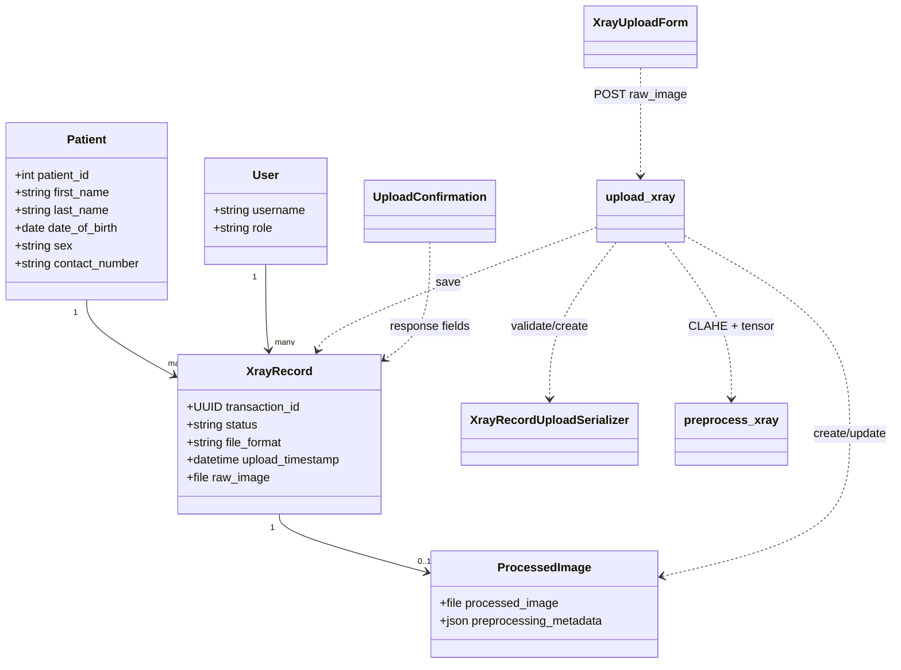

```mermaid
classDiagram
    class Patient {
        +int patient_id
        +string first_name
        +string last_name
        +date date_of_birth
        +string sex
        +string contact_number
    }

    class User {
        +string username
        +string role
    }

    class XrayRecord {
        +UUID transaction_id
        +string status
        +string file_format
        +datetime upload_timestamp
        +file raw_image
    }

    class ProcessedImage {
        +file processed_image
        +json preprocessing_metadata
    }

    class XrayRecordUploadSerializer
    class upload_xray
    class preprocess_xray
    class XrayUploadForm
    class UploadConfirmation

    Patient "1" --> "many" XrayRecord
    User "1" --> "many" XrayRecord
    XrayRecord "1" --> "0..1" ProcessedImage

    XrayUploadForm ..> upload_xray : POST raw_image
    upload_xray ..> XrayRecordUploadSerializer : validate/create
    upload_xray ..> preprocess_xray : CLAHE + tensor
    upload_xray ..> XrayRecord : save
    upload_xray ..> ProcessedImage : create/update
    UploadConfirmation ..> XrayRecord : response fields
```
