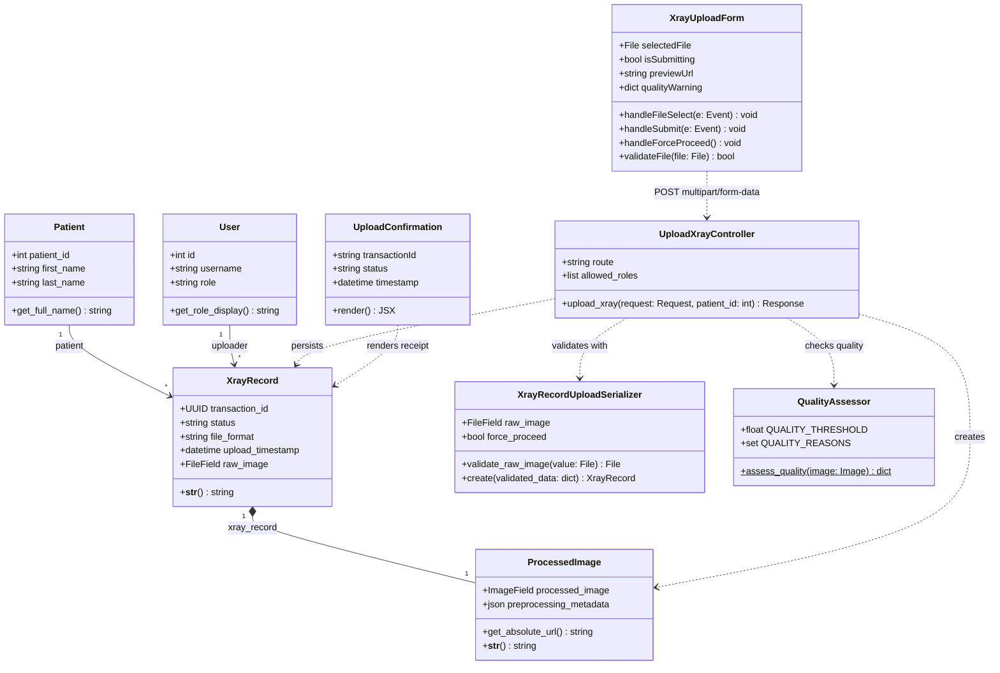

```mermaid
classDiagram
    class Patient {
        +int patient_id
        +string first_name
        +string last_name
        +get_full_name() string
    }

    class User {
        +int id
        +string username
        +string role
        +get_role_display() string
    }

    class XrayRecord {
        +UUID transaction_id
        +string status
        +string file_format
        +datetime upload_timestamp
        +FileField raw_image
        +__str__() string
    }

    class ProcessedImage {
        +ImageField processed_image
        +json preprocessing_metadata
        +get_absolute_url() string
        +__str__() string
    }

    class XrayRecordUploadSerializer {
        +FileField raw_image
        +bool force_proceed
        +validate_raw_image(value: File) File
        +create(validated_data: dict) XrayRecord
    }

    class QualityAssessor {
        +float QUALITY_THRESHOLD
        +set QUALITY_REASONS
        +assess_quality(image: Image)$ dict
    }

    class UploadXrayController {
        +string route
        +list allowed_roles
        +upload_xray(request: Request, patient_id: int) Response
    }

    class XrayUploadForm {
        +File selectedFile
        +bool isSubmitting
        +string previewUrl
        +dict qualityWarning
        +handleFileSelect(e: Event) void
        +handleSubmit(e: Event) void
        +handleForceProceed() void
        +validateFile(file: File) bool
    }

    class UploadConfirmation {
        +string transactionId
        +string status
        +datetime timestamp
        +render() JSX
    }

    Patient "1" --> "*" XrayRecord : patient
    User "1" --> "*" XrayRecord : uploader
    XrayRecord "1" *-- "1" ProcessedImage : xray_record
    UploadXrayController ..> XrayRecordUploadSerializer : validates with
    UploadXrayController ..> QualityAssessor : checks quality
    UploadXrayController ..> XrayRecord : persists
    UploadXrayController ..> ProcessedImage : creates
    XrayUploadForm ..> UploadXrayController : POST multipart/form-data
    UploadConfirmation ..> XrayRecord : renders receipt
```
