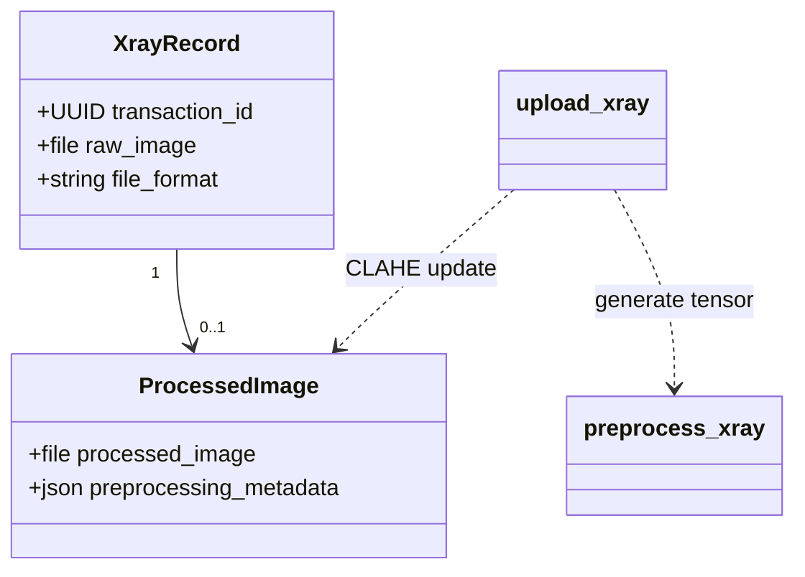

```mermaid
classDiagram
    class XrayRecord {
        +UUID transaction_id
        +file raw_image
        +string file_format
    }

    class ProcessedImage {
        +file processed_image
        +json preprocessing_metadata
    }

    class upload_xray
    class preprocess_xray

    XrayRecord "1" --> "0..1" ProcessedImage
    upload_xray ..> ProcessedImage : CLAHE update
    upload_xray ..> preprocess_xray : generate tensor
```
