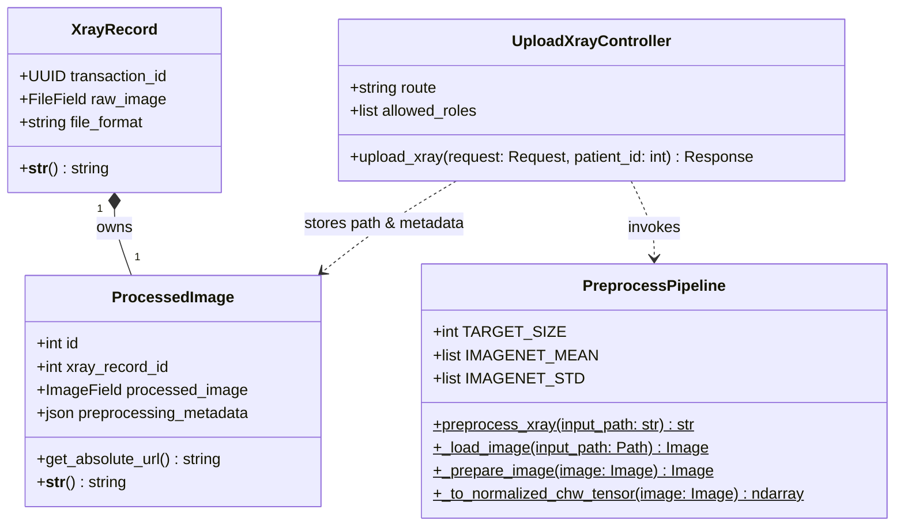

```mermaid
classDiagram
    class XrayRecord {
        +UUID transaction_id
        +FileField raw_image
        +string file_format
        +__str__() string
    }

    class ProcessedImage {
        +int id
        +int xray_record_id
        +ImageField processed_image
        +json preprocessing_metadata
        +get_absolute_url() string
        +__str__() string
    }

    class PreprocessPipeline {
        +int TARGET_SIZE
        +list IMAGENET_MEAN
        +list IMAGENET_STD
        +preprocess_xray(input_path: str)$ str
        +_load_image(input_path: Path)$ Image
        +_prepare_image(image: Image)$ Image
        +_to_normalized_chw_tensor(image: Image)$ ndarray
    }

    class UploadXrayController {
        +string route
        +list allowed_roles
        +upload_xray(request: Request, patient_id: int) Response
    }

    XrayRecord "1" *-- "1" ProcessedImage : owns
    UploadXrayController ..> PreprocessPipeline : invokes
    UploadXrayController ..> ProcessedImage : stores path & metadata
```
