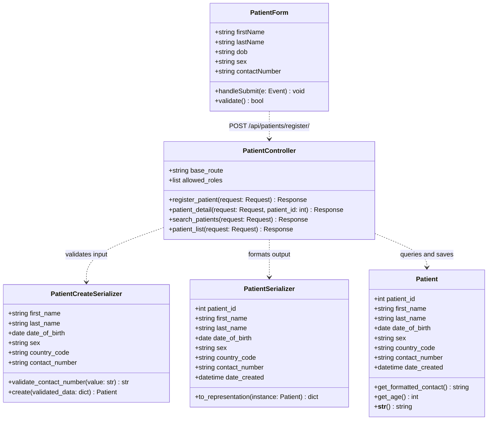

```mermaid
classDiagram
    class Patient {
        +int patient_id
        +string first_name
        +string last_name
        +date date_of_birth
        +string sex
        +string country_code
        +string contact_number
        +datetime date_created
        +get_formatted_contact() string
        +get_age() int
        +__str__() string
    }

    class PatientCreateSerializer {
        +string first_name
        +string last_name
        +date date_of_birth
        +string sex
        +string country_code
        +string contact_number
        +validate_contact_number(value: str) str
        +create(validated_data: dict) Patient
    }

    class PatientSerializer {
        +int patient_id
        +string first_name
        +string last_name
        +date date_of_birth
        +string sex
        +string country_code
        +string contact_number
        +datetime date_created
        +to_representation(instance: Patient) dict
    }

    class PatientController {
        +string base_route
        +list allowed_roles
        +register_patient(request: Request) Response
        +patient_detail(request: Request, patient_id: int) Response
        +search_patients(request: Request) Response
        +patient_list(request: Request) Response
    }

    class PatientForm {
        +string firstName
        +string lastName
        +string dob
        +string sex
        +string contactNumber
        +handleSubmit(e: Event) void
        +validate() bool
    }

    PatientController ..> PatientCreateSerializer : validates input
    PatientController ..> PatientSerializer : formats output
    PatientController ..> Patient : queries and saves
    PatientForm ..> PatientController : POST /api/patients/register/
```
