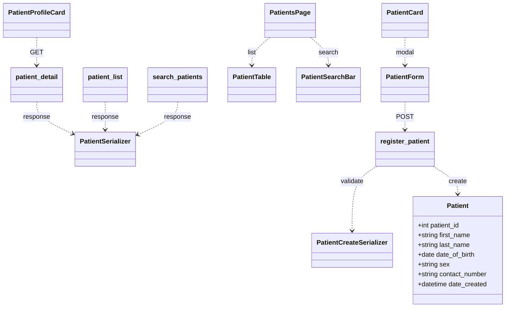

```mermaid
classDiagram
    class Patient {
        +int patient_id
        +string first_name
        +string last_name
        +date date_of_birth
        +string sex
        +string contact_number
        +datetime date_created
    }

    class PatientCreateSerializer
    class PatientSerializer
    class register_patient
    class patient_list
    class patient_detail
    class search_patients

    class PatientsPage
    class PatientTable
    class PatientSearchBar
    class PatientCard
    class PatientForm
    class PatientProfileCard

    PatientForm ..> register_patient : POST
    PatientsPage ..> PatientTable : list
    PatientsPage ..> PatientSearchBar : search
    PatientCard ..> PatientForm : modal
    PatientProfileCard ..> patient_detail : GET

    register_patient ..> PatientCreateSerializer : validate
    register_patient ..> Patient : create
    patient_detail ..> PatientSerializer : response
    patient_list ..> PatientSerializer : response
    search_patients ..> PatientSerializer : response
```
