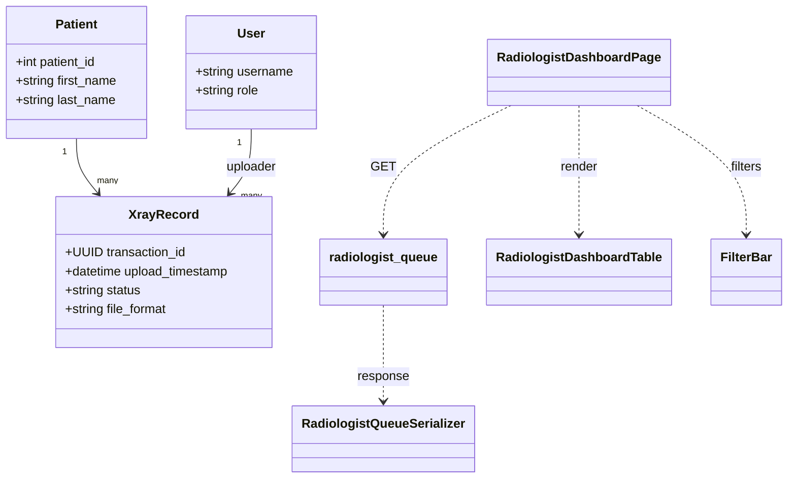

```mermaid
classDiagram
    class Patient {
        +int patient_id
        +string first_name
        +string last_name
    }

    class User {
        +string username
        +string role
    }

    class XrayRecord {
        +UUID transaction_id
        +datetime upload_timestamp
        +string status
        +string file_format
    }

    class radiologist_queue
    class RadiologistQueueSerializer

    class RadiologistDashboardPage
    class RadiologistDashboardTable
    class FilterBar

    Patient "1" --> "many" XrayRecord
    User "1" --> "many" XrayRecord : uploader

    RadiologistDashboardPage ..> radiologist_queue : GET
    radiologist_queue ..> RadiologistQueueSerializer : response
    RadiologistDashboardPage ..> RadiologistDashboardTable : render
    RadiologistDashboardPage ..> FilterBar : filters
```
