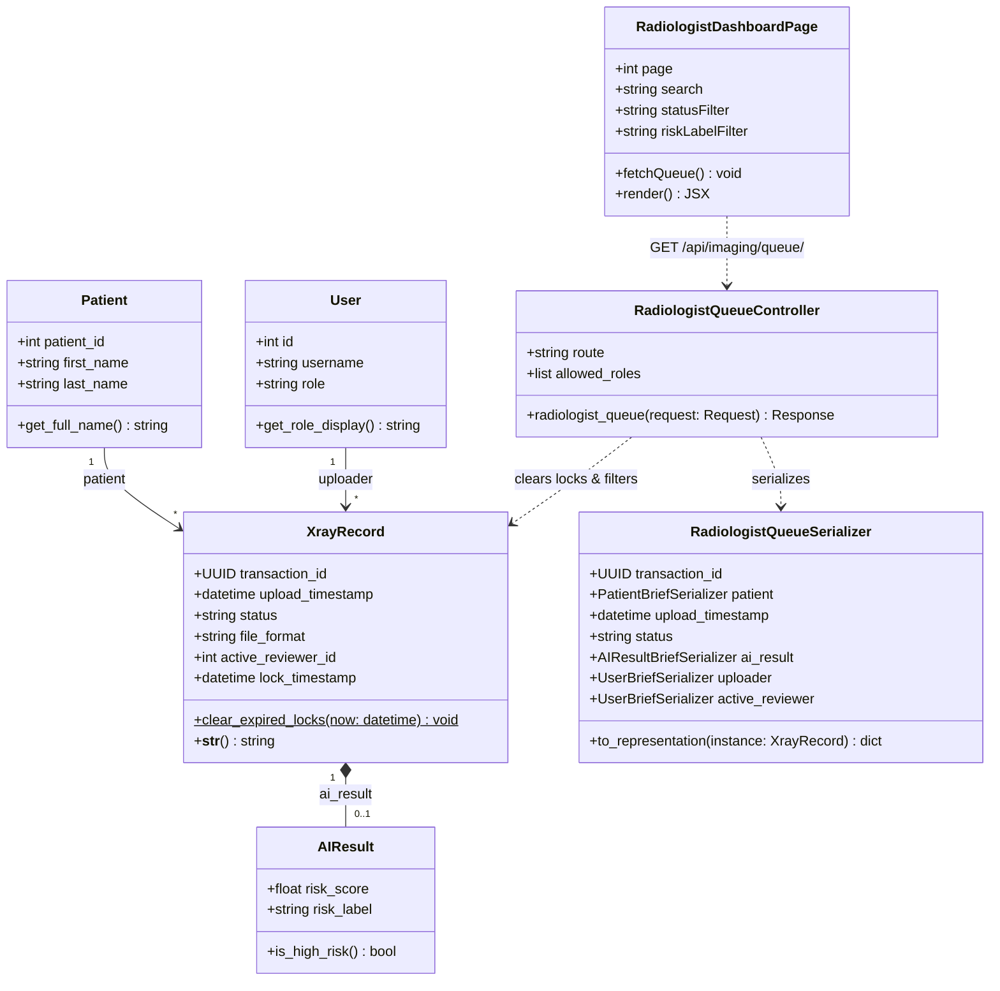

```mermaid
classDiagram
    class Patient {
        +int patient_id
        +string first_name
        +string last_name
        +get_full_name() string
    }

    class User {
        +int id
        +string username
        +string role
        +get_role_display() string
    }

    class AIResult {
        +float risk_score
        +string risk_label
        +is_high_risk() bool
    }

    class XrayRecord {
        +UUID transaction_id
        +datetime upload_timestamp
        +string status
        +string file_format
        +int active_reviewer_id
        +datetime lock_timestamp
        +clear_expired_locks(now: datetime)$ void
        +__str__() string
    }

    class RadiologistQueueSerializer {
        +UUID transaction_id
        +PatientBriefSerializer patient
        +datetime upload_timestamp
        +string status
        +AIResultBriefSerializer ai_result
        +UserBriefSerializer uploader
        +UserBriefSerializer active_reviewer
        +to_representation(instance: XrayRecord) dict
    }

    class RadiologistQueueController {
        +string route
        +list allowed_roles
        +radiologist_queue(request: Request) Response
    }

    class RadiologistDashboardPage {
        +int page
        +string search
        +string statusFilter
        +string riskLabelFilter
        +fetchQueue() void
        +render() JSX
    }

    Patient "1" --> "*" XrayRecord : patient
    User "1" --> "*" XrayRecord : uploader
    XrayRecord "1" *-- "0..1" AIResult : ai_result
    RadiologistQueueController ..> XrayRecord : clears locks & filters
    RadiologistQueueController ..> RadiologistQueueSerializer : serializes
    RadiologistDashboardPage ..> RadiologistQueueController : GET /api/imaging/queue/
```
