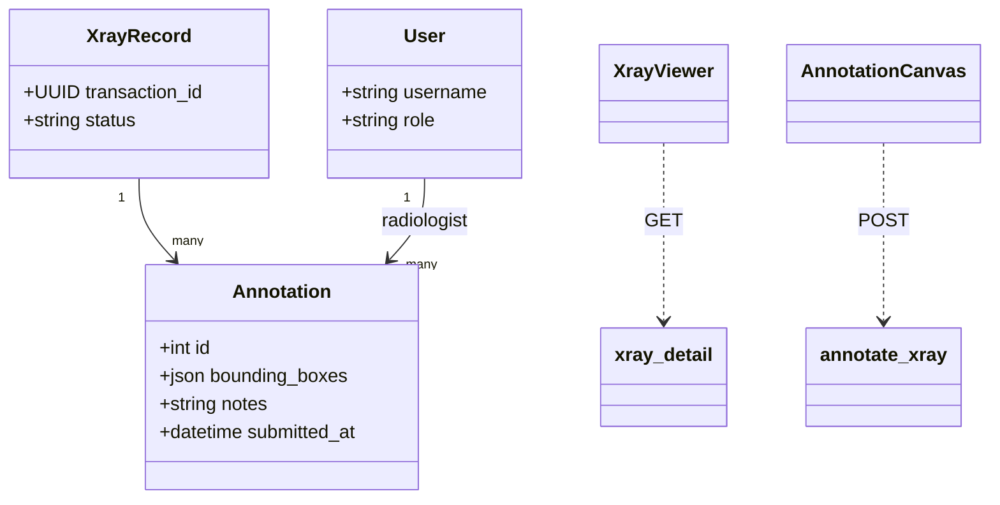

```mermaid
classDiagram
    class XrayRecord {
        +UUID transaction_id
        +string status
    }

    class Annotation {
        +int id
        +json bounding_boxes
        +string notes
        +datetime submitted_at
    }

    class User {
        +string username
        +string role
    }

    class xray_detail
    class annotate_xray

    class XrayViewer
    class AnnotationCanvas

    XrayRecord "1" --> "many" Annotation
    User "1" --> "many" Annotation : radiologist

    XrayViewer ..> xray_detail : GET
    AnnotationCanvas ..> annotate_xray : POST
```
