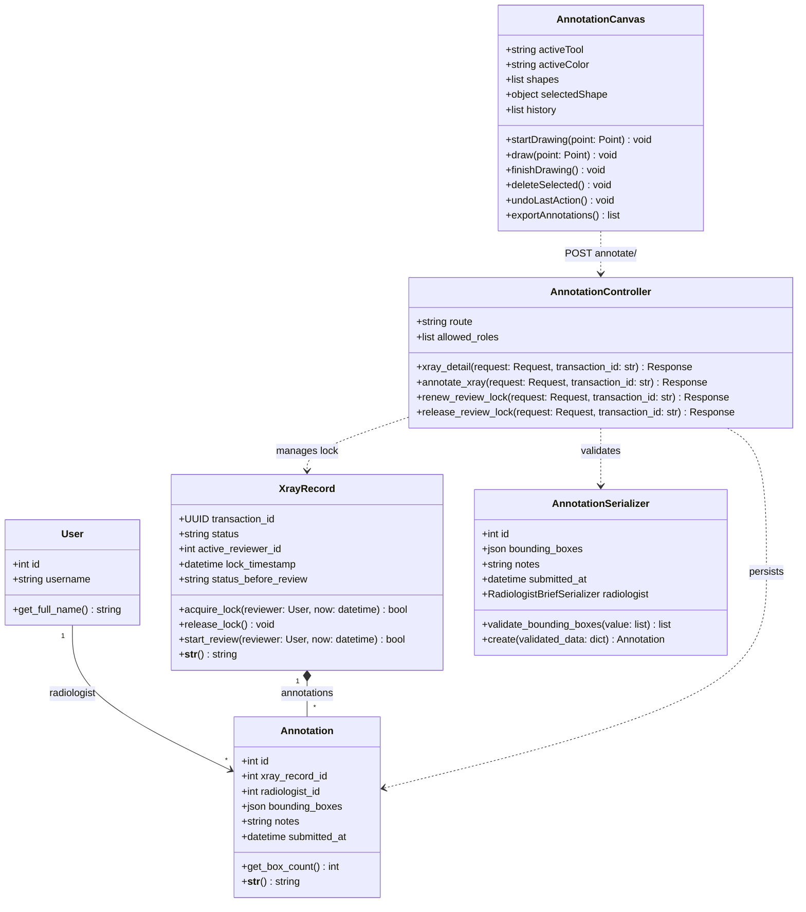

```mermaid
classDiagram
    class User {
        +int id
        +string username
        +get_full_name() string
    }

    class XrayRecord {
        +UUID transaction_id
        +string status
        +int active_reviewer_id
        +datetime lock_timestamp
        +string status_before_review
        +acquire_lock(reviewer: User, now: datetime) bool
        +release_lock() void
        +start_review(reviewer: User, now: datetime) bool
        +__str__() string
    }

    class Annotation {
        +int id
        +int xray_record_id
        +int radiologist_id
        +json bounding_boxes
        +string notes
        +datetime submitted_at
        +get_box_count() int
        +__str__() string
    }

    class AnnotationSerializer {
        +int id
        +json bounding_boxes
        +string notes
        +datetime submitted_at
        +RadiologistBriefSerializer radiologist
        +validate_bounding_boxes(value: list) list
        +create(validated_data: dict) Annotation
    }

    class AnnotationController {
        +string route
        +list allowed_roles
        +xray_detail(request: Request, transaction_id: str) Response
        +annotate_xray(request: Request, transaction_id: str) Response
        +renew_review_lock(request: Request, transaction_id: str) Response
        +release_review_lock(request: Request, transaction_id: str) Response
    }

    class AnnotationCanvas {
        +string activeTool
        +string activeColor
        +list shapes
        +object selectedShape
        +list history
        +startDrawing(point: Point) void
        +draw(point: Point) void
        +finishDrawing() void
        +deleteSelected() void
        +undoLastAction() void
        +exportAnnotations() list
    }

    User "1" --> "*" Annotation : radiologist
    XrayRecord "1" *-- "*" Annotation : annotations
    AnnotationController ..> AnnotationSerializer : validates
    AnnotationController ..> Annotation : persists
    AnnotationController ..> XrayRecord : manages lock
    AnnotationCanvas ..> AnnotationController : POST annotate/
```
