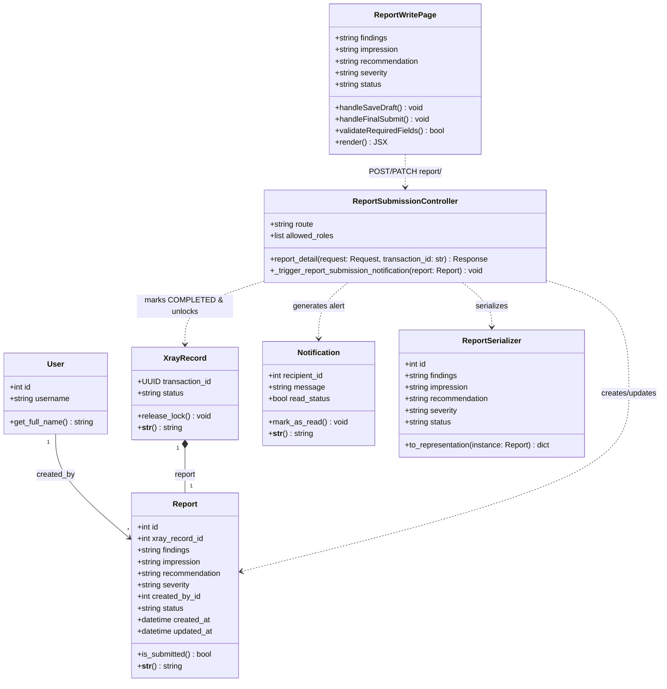

```mermaid
classDiagram
    class User {
        +int id
        +string username
        +get_full_name() string
    }

    class XrayRecord {
        +UUID transaction_id
        +string status
        +release_lock() void
        +__str__() string
    }

    class Report {
        +int id
        +int xray_record_id
        +string findings
        +string impression
        +string recommendation
        +string severity
        +int created_by_id
        +string status
        +datetime created_at
        +datetime updated_at
        +is_submitted() bool
        +__str__() string
    }

    class Notification {
        +int recipient_id
        +string message
        +bool read_status
        +mark_as_read() void
        +__str__() string
    }

    class ReportSerializer {
        +int id
        +string findings
        +string impression
        +string recommendation
        +string severity
        +string status
        +to_representation(instance: Report) dict
    }

    class ReportSubmissionController {
        +string route
        +list allowed_roles
        +report_detail(request: Request, transaction_id: str) Response
        +_trigger_report_submission_notification(report: Report) void
    }

    class ReportWritePage {
        +string findings
        +string impression
        +string recommendation
        +string severity
        +string status
        +handleSaveDraft() void
        +handleFinalSubmit() void
        +validateRequiredFields() bool
        +render() JSX
    }

    User "1" --> "*" Report : created_by
    XrayRecord "1" *-- "1" Report : report
    ReportSubmissionController ..> ReportSerializer : serializes
    ReportSubmissionController ..> Report : creates/updates
    ReportSubmissionController ..> XrayRecord : marks COMPLETED & unlocks
    ReportSubmissionController ..> Notification : generates alert
    ReportWritePage ..> ReportSubmissionController : POST/PATCH report/
```
