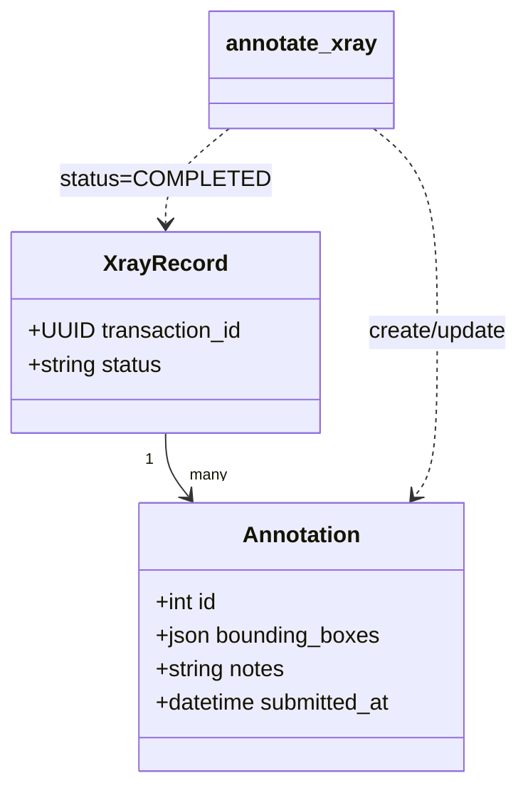

```mermaid
classDiagram
    class XrayRecord {
        +UUID transaction_id
        +string status
    }

    class Annotation {
        +int id
        +json bounding_boxes
        +string notes
        +datetime submitted_at
    }

    class annotate_xray

    XrayRecord "1" --> "many" Annotation
    annotate_xray ..> Annotation : create/update
    annotate_xray ..> XrayRecord : status=COMPLETED
```
