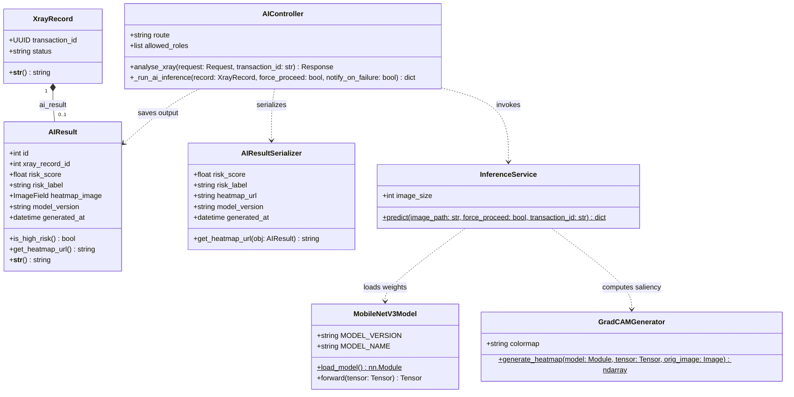

```mermaid
classDiagram
    class XrayRecord {
        +UUID transaction_id
        +string status
        +__str__() string
    }

    class AIResult {
        +int id
        +int xray_record_id
        +float risk_score
        +string risk_label
        +ImageField heatmap_image
        +string model_version
        +datetime generated_at
        +is_high_risk() bool
        +get_heatmap_url() string
        +__str__() string
    }

    class AIResultSerializer {
        +float risk_score
        +string risk_label
        +string heatmap_url
        +string model_version
        +datetime generated_at
        +get_heatmap_url(obj: AIResult) string
    }

    class MobileNetV3Model {
        +string MODEL_VERSION
        +string MODEL_NAME
        +load_model()$ nn.Module
        +forward(tensor: Tensor) Tensor
    }

    class GradCAMGenerator {
        +string colormap
        +generate_heatmap(model: Module, tensor: Tensor, orig_image: Image)$ ndarray
    }

    class InferenceService {
        +int image_size
        +predict(image_path: str, force_proceed: bool, transaction_id: str)$ dict
    }

    class AIController {
        +string route
        +list allowed_roles
        +analyse_xray(request: Request, transaction_id: str) Response
        +_run_ai_inference(record: XrayRecord, force_proceed: bool, notify_on_failure: bool) dict
    }

    XrayRecord "1" *-- "0..1" AIResult : ai_result
    AIController ..> InferenceService : invokes
    InferenceService ..> MobileNetV3Model : loads weights
    InferenceService ..> GradCAMGenerator : computes saliency
    AIController ..> AIResult : saves output
    AIController ..> AIResultSerializer : serializes
```
