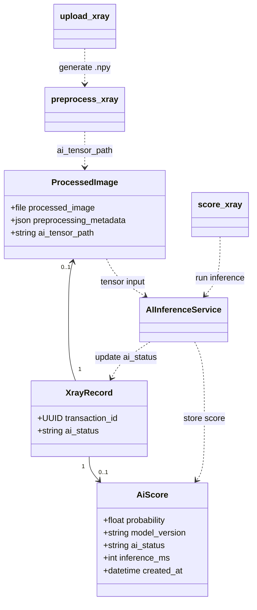

```mermaid
classDiagram
    class ProcessedImage {
        +file processed_image
        +json preprocessing_metadata
        +string ai_tensor_path
    }

    class XrayRecord {
        +UUID transaction_id
        +string ai_status
    }

    class AiScore {
        +float probability
        +string model_version
        +string ai_status
        +int inference_ms
        +datetime created_at
    }

    class preprocess_xray
    class upload_xray
    class score_xray
    class AIInferenceService

    XrayRecord "1" --> "0..1" ProcessedImage
    XrayRecord "1" --> "0..1" AiScore
    upload_xray ..> preprocess_xray : generate .npy
    preprocess_xray ..> ProcessedImage : ai_tensor_path
    score_xray ..> AIInferenceService : run inference
    AIInferenceService ..> AiScore : store score
    AIInferenceService ..> XrayRecord : update ai_status
    ProcessedImage ..> AIInferenceService : tensor input
```
