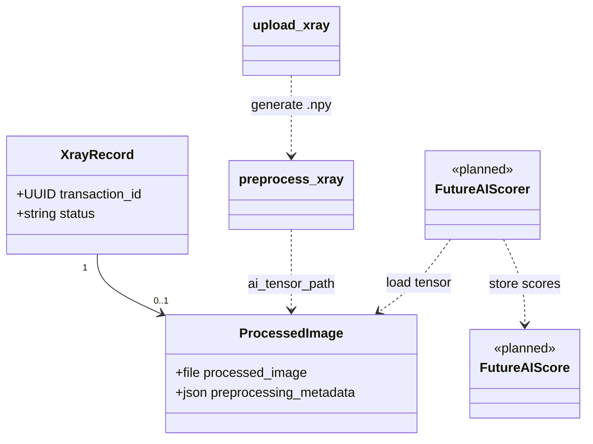

```mermaid
classDiagram
    class ProcessedImage {
        +file processed_image
        +json preprocessing_metadata
    }

    class XrayRecord {
        +UUID transaction_id
        +string status
    }

    class preprocess_xray
    class upload_xray

    class FutureAIScorer <<planned>>
    class FutureAIScore <<planned>>

    XrayRecord "1" --> "0..1" ProcessedImage
    upload_xray ..> preprocess_xray : generate .npy
    preprocess_xray ..> ProcessedImage : ai_tensor_path

    FutureAIScorer ..> ProcessedImage : load tensor
    FutureAIScorer ..> FutureAIScore : store scores
```
