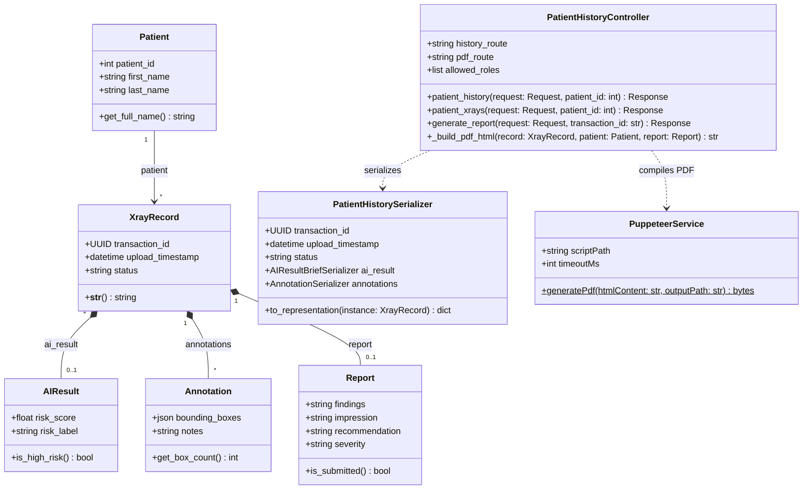

```mermaid
classDiagram
    class Patient {
        +int patient_id
        +string first_name
        +string last_name
        +get_full_name() string
    }

    class XrayRecord {
        +UUID transaction_id
        +datetime upload_timestamp
        +string status
        +__str__() string
    }

    class AIResult {
        +float risk_score
        +string risk_label
        +is_high_risk() bool
    }

    class Annotation {
        +json bounding_boxes
        +string notes
        +get_box_count() int
    }

    class Report {
        +string findings
        +string impression
        +string recommendation
        +string severity
        +is_submitted() bool
    }

    class PatientHistorySerializer {
        +UUID transaction_id
        +datetime upload_timestamp
        +string status
        +AIResultBriefSerializer ai_result
        +AnnotationSerializer annotations
        +to_representation(instance: XrayRecord) dict
    }

    class PatientHistoryController {
        +string history_route
        +string pdf_route
        +list allowed_roles
        +patient_history(request: Request, patient_id: int) Response
        +patient_xrays(request: Request, patient_id: int) Response
        +generate_report(request: Request, transaction_id: str) Response
        +_build_pdf_html(record: XrayRecord, patient: Patient, report: Report) str
    }

    class PuppeteerService {
        +string scriptPath
        +int timeoutMs
        +generatePdf(htmlContent: str, outputPath: str)$ bytes
    }

    Patient "1" --> "*" XrayRecord : patient
    XrayRecord "1" *-- "0..1" AIResult : ai_result
    XrayRecord "1" *-- "*" Annotation : annotations
    XrayRecord "1" *-- "0..1" Report : report
    PatientHistoryController ..> PatientHistorySerializer : serializes
    PatientHistoryController ..> PuppeteerService : compiles PDF
```
