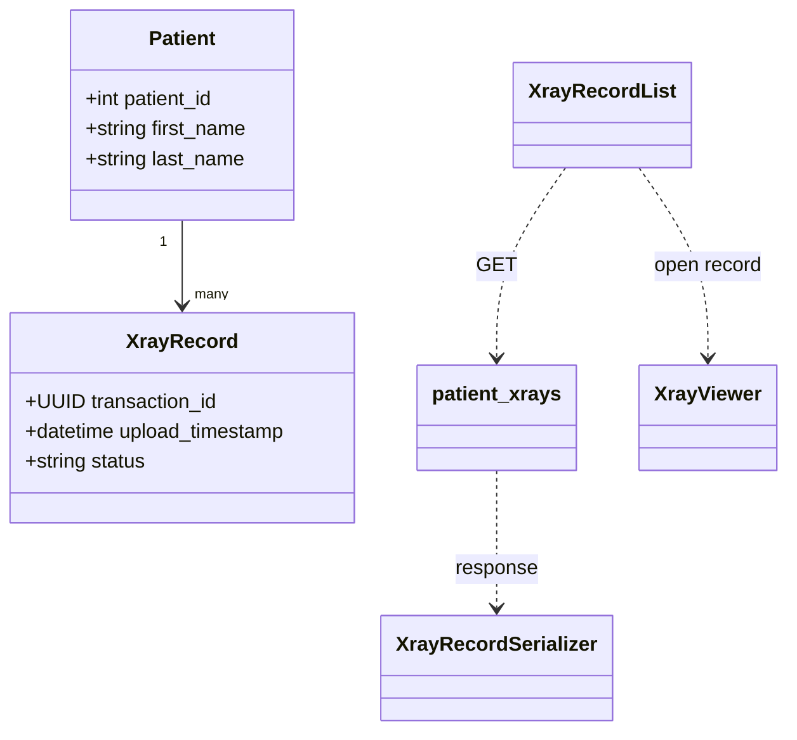

```mermaid
classDiagram
    class Patient {
        +int patient_id
        +string first_name
        +string last_name
    }

    class XrayRecord {
        +UUID transaction_id
        +datetime upload_timestamp
        +string status
    }

    class patient_xrays
    class XrayRecordSerializer

    class XrayRecordList
    class XrayViewer

    Patient "1" --> "many" XrayRecord

    XrayRecordList ..> patient_xrays : GET
    patient_xrays ..> XrayRecordSerializer : response
    XrayRecordList ..> XrayViewer : open record
```
