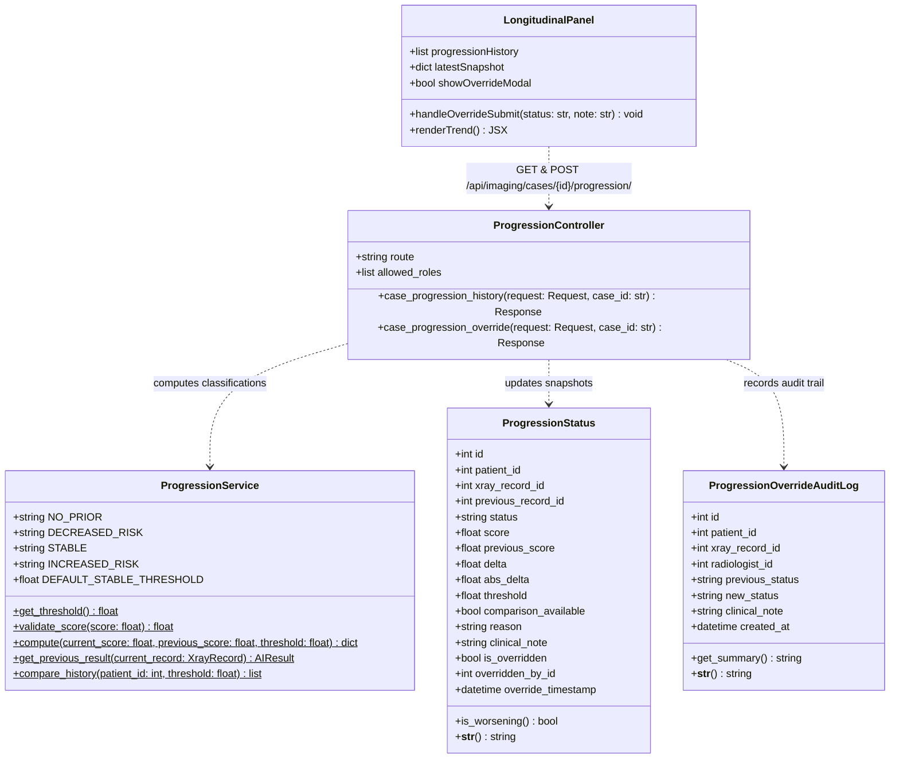

```mermaid
classDiagram
    class ProgressionStatus {
        +int id
        +int patient_id
        +int xray_record_id
        +int previous_record_id
        +string status
        +float score
        +float previous_score
        +float delta
        +float abs_delta
        +float threshold
        +bool comparison_available
        +string reason
        +string clinical_note
        +bool is_overridden
        +int overridden_by_id
        +datetime override_timestamp
        +is_worsening() bool
        +__str__() string
    }

    class ProgressionOverrideAuditLog {
        +int id
        +int patient_id
        +int xray_record_id
        +int radiologist_id
        +string previous_status
        +string new_status
        +string clinical_note
        +datetime created_at
        +get_summary() string
        +__str__() string
    }

    class ProgressionService {
        +string NO_PRIOR
        +string DECREASED_RISK
        +string STABLE
        +string INCREASED_RISK
        +float DEFAULT_STABLE_THRESHOLD
        +get_threshold()$ float
        +validate_score(score: float)$ float
        +compute(current_score: float, previous_score: float, threshold: float)$ dict
        +get_previous_result(current_record: XrayRecord)$ AIResult
        +compare_history(patient_id: int, threshold: float)$ list
    }

    class ProgressionController {
        +string route
        +list allowed_roles
        +case_progression_history(request: Request, case_id: str) Response
        +case_progression_override(request: Request, case_id: str) Response
    }

    class LongitudinalPanel {
        +list progressionHistory
        +dict latestSnapshot
        +bool showOverrideModal
        +handleOverrideSubmit(status: str, note: str) void
        +renderTrend() JSX
    }

    ProgressionController ..> ProgressionService : computes classifications
    ProgressionController ..> ProgressionStatus : updates snapshots
    ProgressionController ..> ProgressionOverrideAuditLog : records audit trail
    LongitudinalPanel ..> ProgressionController : GET & POST /api/imaging/cases/{id}/progression/
```
