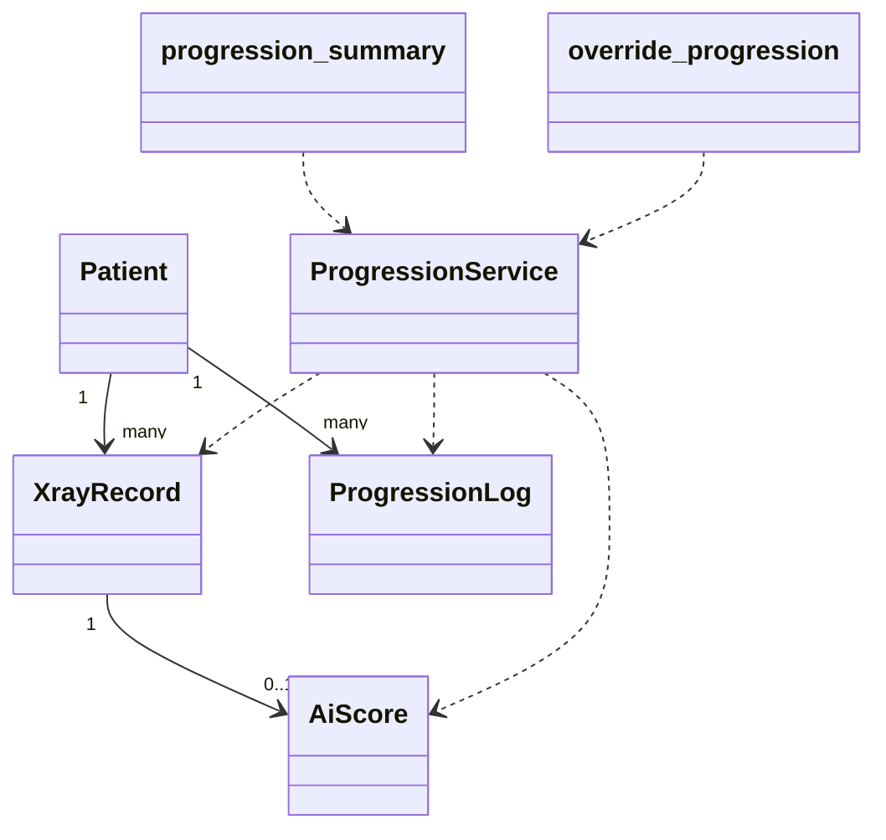

```mermaid
classDiagram
    class Patient
    class XrayRecord
    class AiScore
    class ProgressionLog
    class ProgressionService
    class progression_summary
    class override_progression

    Patient "1" --> "many" XrayRecord
    XrayRecord "1" --> "0..1" AiScore
    Patient "1" --> "many" ProgressionLog

    progression_summary ..> ProgressionService
    override_progression ..> ProgressionService
    ProgressionService ..> AiScore
    ProgressionService ..> ProgressionLog
    ProgressionService ..> XrayRecord
```
