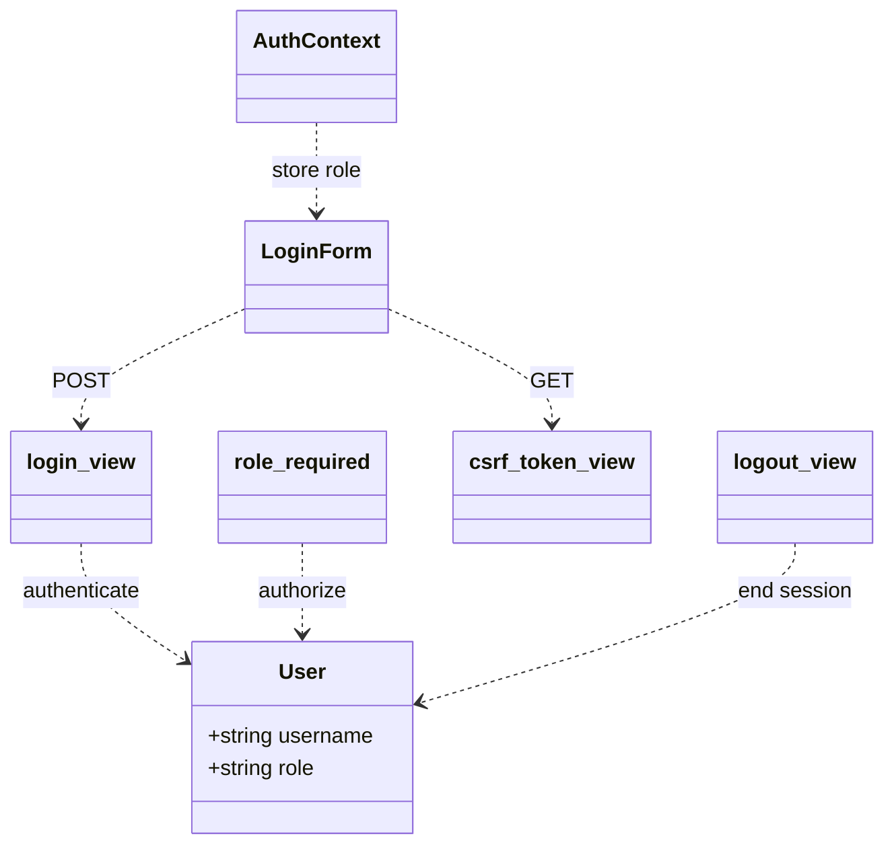

```mermaid
classDiagram
    class User {
        +string username
        +string role
    }

    class AuthContext
    class LoginForm
    class login_view
    class logout_view
    class csrf_token_view
    class role_required

    LoginForm ..> csrf_token_view : GET
    LoginForm ..> login_view : POST
    AuthContext ..> LoginForm : store role
    login_view ..> User : authenticate
    role_required ..> User : authorize
    logout_view ..> User : end session
```
