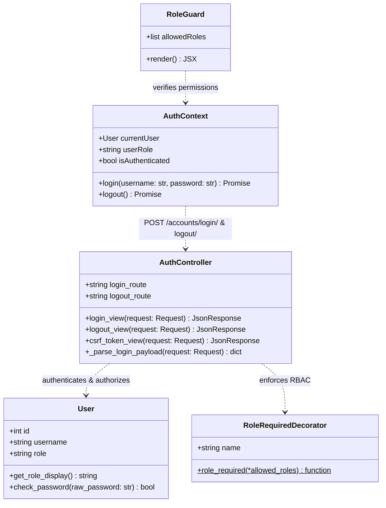

```mermaid
classDiagram
    class User {
        +int id
        +string username
        +string role
        +get_role_display() string
        +check_password(raw_password: str) bool
    }

    class RoleRequiredDecorator {
        +string name
        +role_required(*allowed_roles)$ function
    }

    class AuthController {
        +string login_route
        +string logout_route
        +login_view(request: Request) JsonResponse
        +logout_view(request: Request) JsonResponse
        +csrf_token_view(request: Request) JsonResponse
        +_parse_login_payload(request: Request) dict
    }

    class AuthContext {
        +User currentUser
        +string userRole
        +bool isAuthenticated
        +login(username: str, password: str) Promise
        +logout() Promise
    }

    class RoleGuard {
        +list allowedRoles
        +render() JSX
    }

    AuthController ..> User : authenticates & authorizes
    AuthController ..> RoleRequiredDecorator : enforces RBAC
    AuthContext ..> AuthController : POST /accounts/login/ & logout/
    RoleGuard ..> AuthContext : verifies permissions
```
