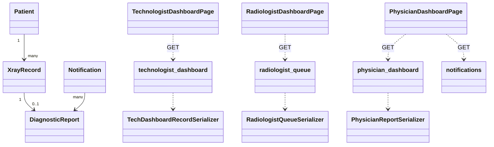

```mermaid
classDiagram
    class Patient
    class XrayRecord
    class DiagnosticReport
    class Notification

    class TechnologistDashboardPage
    class RadiologistDashboardPage
    class PhysicianDashboardPage
    class technologist_dashboard
    class radiologist_queue
    class physician_dashboard
    class notifications
    class TechDashboardRecordSerializer
    class RadiologistQueueSerializer
    class PhysicianReportSerializer

    Patient "1" --> "many" XrayRecord
    XrayRecord "1" --> "0..1" DiagnosticReport
    Notification "many" --> "1" DiagnosticReport

    TechnologistDashboardPage ..> technologist_dashboard : GET
    RadiologistDashboardPage ..> radiologist_queue : GET
    PhysicianDashboardPage ..> physician_dashboard : GET
    PhysicianDashboardPage ..> notifications : GET
    technologist_dashboard ..> TechDashboardRecordSerializer
    radiologist_queue ..> RadiologistQueueSerializer
    physician_dashboard ..> PhysicianReportSerializer
```
