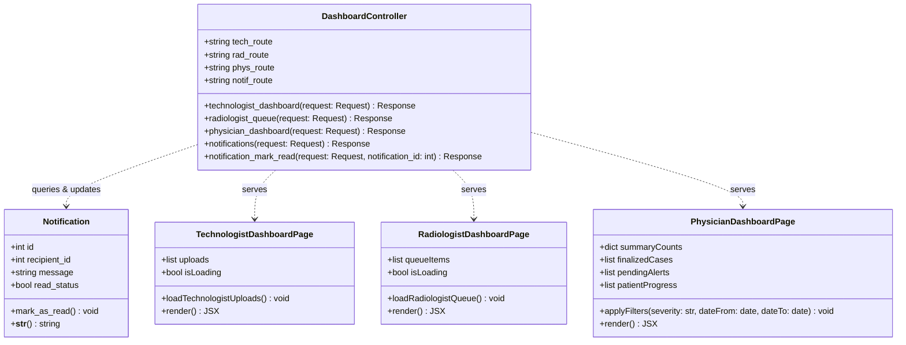

```mermaid
classDiagram
    class Notification {
        +int id
        +int recipient_id
        +string message
        +bool read_status
        +mark_as_read() void
        +__str__() string
    }

    class DashboardController {
        +string tech_route
        +string rad_route
        +string phys_route
        +string notif_route
        +technologist_dashboard(request: Request) Response
        +radiologist_queue(request: Request) Response
        +physician_dashboard(request: Request) Response
        +notifications(request: Request) Response
        +notification_mark_read(request: Request, notification_id: int) Response
    }

    class TechnologistDashboardPage {
        +list uploads
        +bool isLoading
        +loadTechnologistUploads() void
        +render() JSX
    }

    class RadiologistDashboardPage {
        +list queueItems
        +bool isLoading
        +loadRadiologistQueue() void
        +render() JSX
    }

    class PhysicianDashboardPage {
        +dict summaryCounts
        +list finalizedCases
        +list pendingAlerts
        +list patientProgress
        +applyFilters(severity: str, dateFrom: date, dateTo: date) void
        +render() JSX
    }

    DashboardController ..> Notification : queries & updates
    DashboardController ..> TechnologistDashboardPage : serves
    DashboardController ..> RadiologistDashboardPage : serves
    DashboardController ..> PhysicianDashboardPage : serves
```
