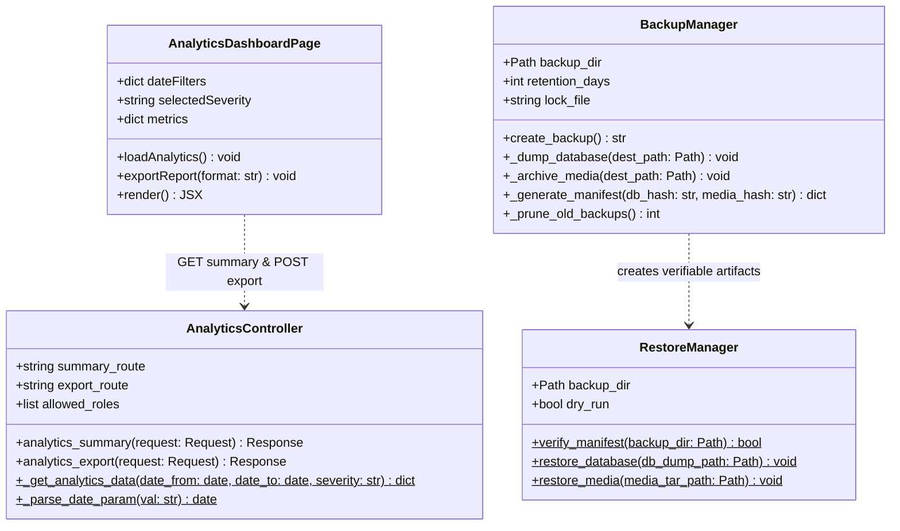

```mermaid
classDiagram
    class AnalyticsController {
        +string summary_route
        +string export_route
        +list allowed_roles
        +analytics_summary(request: Request) Response
        +analytics_export(request: Request) Response
        +_get_analytics_data(date_from: date, date_to: date, severity: str)$ dict
        +_parse_date_param(val: str)$ date
    }

    class AnalyticsDashboardPage {
        +dict dateFilters
        +string selectedSeverity
        +dict metrics
        +loadAnalytics() void
        +exportReport(format: str) void
        +render() JSX
    }

    class BackupManager {
        +Path backup_dir
        +int retention_days
        +string lock_file
        +create_backup() str
        +_dump_database(dest_path: Path) void
        +_archive_media(dest_path: Path) void
        +_generate_manifest(db_hash: str, media_hash: str) dict
        +_prune_old_backups() int
    }

    class RestoreManager {
        +Path backup_dir
        +bool dry_run
        +verify_manifest(backup_dir: Path)$ bool
        +restore_database(db_dump_path: Path)$ void
        +restore_media(media_tar_path: Path)$ void
    }

    AnalyticsDashboardPage ..> AnalyticsController : GET summary & POST export
    BackupManager ..> RestoreManager : creates verifiable artifacts
```
