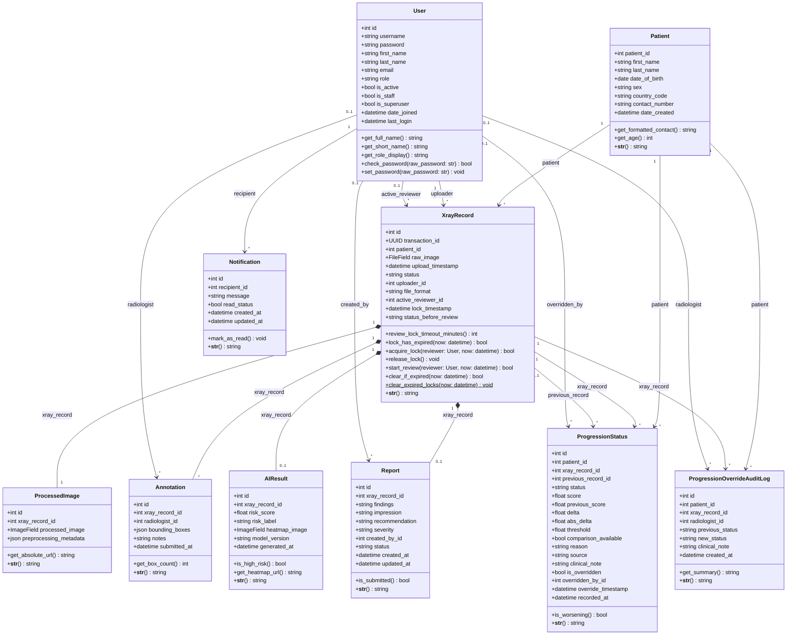

```mermaid
classDiagram
    class User {
        +int id
        +string username
        +string password
        +string first_name
        +string last_name
        +string email
        +string role
        +bool is_active
        +bool is_staff
        +bool is_superuser
        +datetime date_joined
        +datetime last_login
        +get_full_name() string
        +get_short_name() string
        +get_role_display() string
        +check_password(raw_password: str) bool
        +set_password(raw_password: str) void
    }

    class Patient {
        +int patient_id
        +string first_name
        +string last_name
        +date date_of_birth
        +string sex
        +string country_code
        +string contact_number
        +datetime date_created
        +get_formatted_contact() string
        +get_age() int
        +__str__() string
    }

    class XrayRecord {
        +int id
        +UUID transaction_id
        +int patient_id
        +FileField raw_image
        +datetime upload_timestamp
        +string status
        +int uploader_id
        +string file_format
        +int active_reviewer_id
        +datetime lock_timestamp
        +string status_before_review
        +review_lock_timeout_minutes() int
        +lock_has_expired(now: datetime) bool
        +acquire_lock(reviewer: User, now: datetime) bool
        +release_lock() void
        +start_review(reviewer: User, now: datetime) bool
        +clear_if_expired(now: datetime) bool
        +clear_expired_locks(now: datetime)$ void
        +__str__() string
    }

    class ProcessedImage {
        +int id
        +int xray_record_id
        +ImageField processed_image
        +json preprocessing_metadata
        +get_absolute_url() string
        +__str__() string
    }

    class Annotation {
        +int id
        +int xray_record_id
        +int radiologist_id
        +json bounding_boxes
        +string notes
        +datetime submitted_at
        +get_box_count() int
        +__str__() string
    }

    class AIResult {
        +int id
        +int xray_record_id
        +float risk_score
        +string risk_label
        +ImageField heatmap_image
        +string model_version
        +datetime generated_at
        +is_high_risk() bool
        +get_heatmap_url() string
        +__str__() string
    }

    class Report {
        +int id
        +int xray_record_id
        +string findings
        +string impression
        +string recommendation
        +string severity
        +int created_by_id
        +string status
        +datetime created_at
        +datetime updated_at
        +is_submitted() bool
        +__str__() string
    }

    class Notification {
        +int id
        +int recipient_id
        +string message
        +bool read_status
        +datetime created_at
        +datetime updated_at
        +mark_as_read() void
        +__str__() string
    }

    class ProgressionStatus {
        +int id
        +int patient_id
        +int xray_record_id
        +int previous_record_id
        +string status
        +float score
        +float previous_score
        +float delta
        +float abs_delta
        +float threshold
        +bool comparison_available
        +string reason
        +string source
        +string clinical_note
        +bool is_overridden
        +int overridden_by_id
        +datetime override_timestamp
        +datetime recorded_at
        +is_worsening() bool
        +__str__() string
    }

    class ProgressionOverrideAuditLog {
        +int id
        +int patient_id
        +int xray_record_id
        +int radiologist_id
        +string previous_status
        +string new_status
        +string clinical_note
        +datetime created_at
        +get_summary() string
        +__str__() string
    }

    Patient "1" --> "*" XrayRecord : patient
    User "1" --> "*" XrayRecord : uploader
    User "0..1" --> "*" XrayRecord : active_reviewer
    XrayRecord "1" *-- "1" ProcessedImage : xray_record
    XrayRecord "1" *-- "0..1" AIResult : xray_record
    XrayRecord "1" *-- "*" Annotation : xray_record
    User "0..1" --> "*" Annotation : radiologist
    XrayRecord "1" *-- "0..1" Report : xray_record
    User "0..1" --> "*" Report : created_by
    User "1" --> "*" Notification : recipient
    Patient "1" --> "*" ProgressionStatus : patient
    XrayRecord "1" --> "*" ProgressionStatus : xray_record
    XrayRecord "0..1" --> "*" ProgressionStatus : previous_record
    User "0..1" --> "*" ProgressionStatus : overridden_by
    Patient "1" --> "*" ProgressionOverrideAuditLog : patient
    XrayRecord "1" --> "*" ProgressionOverrideAuditLog : xray_record
    User "0..1" --> "*" ProgressionOverrideAuditLog : radiologist
```
