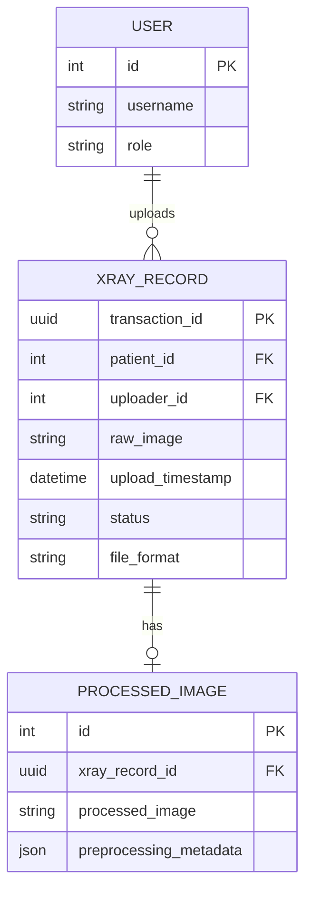

```mermaid
erDiagram
    PROCESSED_IMAGE {
        int id PK
        uuid xray_record_id FK
        string processed_image
        json preprocessing_metadata
    }

    XRAY_RECORD {
        uuid transaction_id PK
        int patient_id FK
        int uploader_id FK
        string raw_image
        datetime upload_timestamp
        string status
        string file_format
    }

    USER {
        int id PK
        string username
        string role
    }

    XRAY_RECORD ||--o| PROCESSED_IMAGE : "has"
    USER ||--o{ XRAY_RECORD : "uploads"
```
