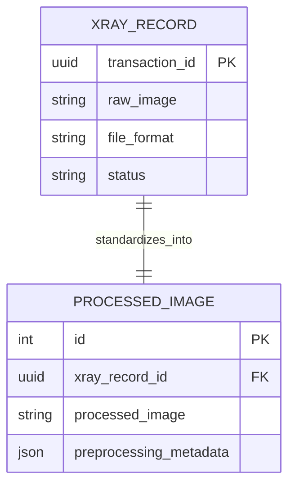

```mermaid
erDiagram
    XRAY_RECORD {
        uuid transaction_id PK
        string raw_image
        string file_format
        string status
    }

    PROCESSED_IMAGE {
        int id PK
        uuid xray_record_id FK
        string processed_image
        json preprocessing_metadata
    }

    XRAY_RECORD ||--|| PROCESSED_IMAGE : "standardizes_into"
```
