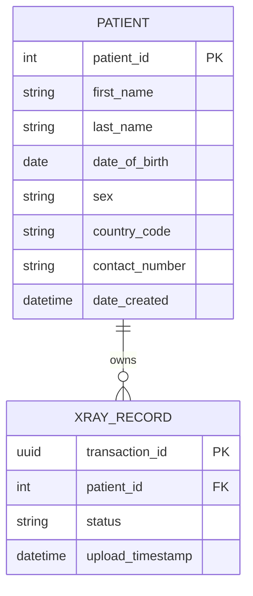

```mermaid
erDiagram
    PATIENT {
        int patient_id PK
        string first_name
        string last_name
        date date_of_birth
        string sex
        string country_code
        string contact_number
        datetime date_created
    }

    XRAY_RECORD {
        uuid transaction_id PK
        int patient_id FK
        string status
        datetime upload_timestamp
    }

    PATIENT ||--o{ XRAY_RECORD : "owns"
```
