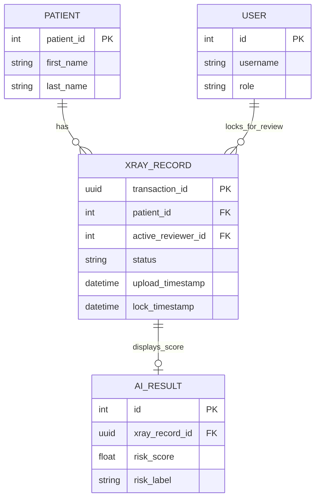

```mermaid
erDiagram
    PATIENT {
        int patient_id PK
        string first_name
        string last_name
    }

    USER {
        int id PK
        string username
        string role
    }

    XRAY_RECORD {
        uuid transaction_id PK
        int patient_id FK
        int active_reviewer_id FK
        string status
        datetime upload_timestamp
        datetime lock_timestamp
    }

    AI_RESULT {
        int id PK
        uuid xray_record_id FK
        float risk_score
        string risk_label
    }

    PATIENT ||--o{ XRAY_RECORD : "has"
    USER ||--o{ XRAY_RECORD : "locks_for_review"
    XRAY_RECORD ||--o| AI_RESULT : "displays_score"
```
