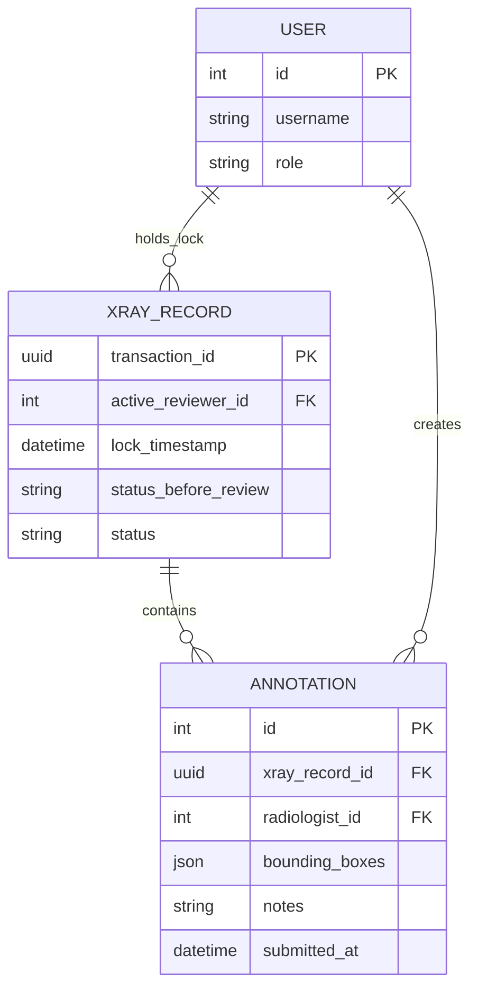

```mermaid
erDiagram
    XRAY_RECORD {
        uuid transaction_id PK
        int active_reviewer_id FK
        datetime lock_timestamp
        string status_before_review
        string status
    }

    ANNOTATION {
        int id PK
        uuid xray_record_id FK
        int radiologist_id FK
        json bounding_boxes
        string notes
        datetime submitted_at
    }

    USER {
        int id PK
        string username
        string role
    }

    XRAY_RECORD ||--o{ ANNOTATION : "contains"
    USER ||--o{ ANNOTATION : "creates"
    USER ||--o{ XRAY_RECORD : "holds_lock"
```
