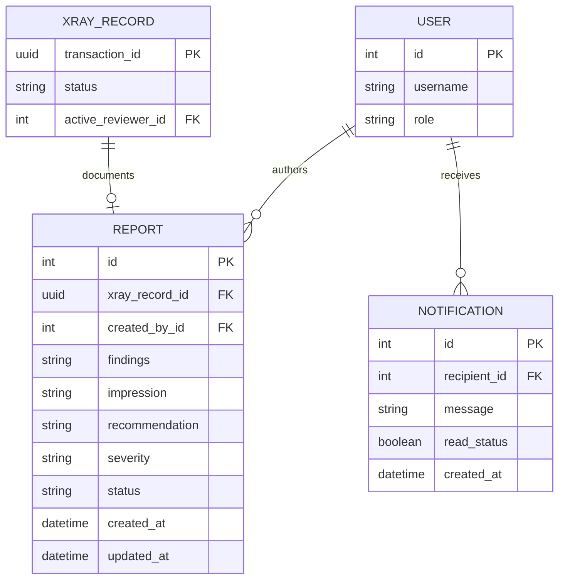

```mermaid
erDiagram
    XRAY_RECORD {
        uuid transaction_id PK
        string status
        int active_reviewer_id FK
    }

    REPORT {
        int id PK
        uuid xray_record_id FK
        int created_by_id FK
        string findings
        string impression
        string recommendation
        string severity
        string status
        datetime created_at
        datetime updated_at
    }

    USER {
        int id PK
        string username
        string role
    }

    NOTIFICATION {
        int id PK
        int recipient_id FK
        string message
        boolean read_status
        datetime created_at
    }

    XRAY_RECORD ||--o| REPORT : "documents"
    USER ||--o{ REPORT : "authors"
    USER ||--o{ NOTIFICATION : "receives"
```
