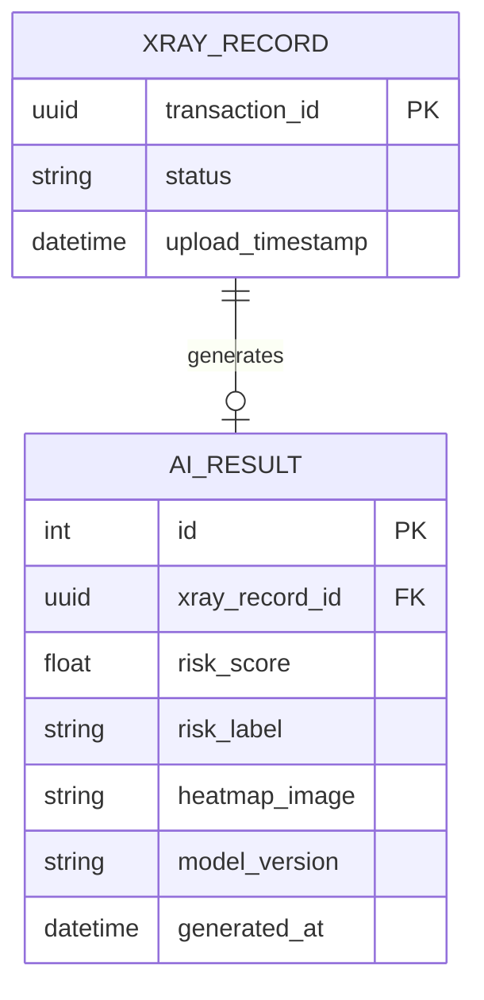

```mermaid
erDiagram
    XRAY_RECORD {
        uuid transaction_id PK
        string status
        datetime upload_timestamp
    }

    AI_RESULT {
        int id PK
        uuid xray_record_id FK
        float risk_score
        string risk_label
        string heatmap_image
        string model_version
        datetime generated_at
    }

    XRAY_RECORD ||--o| AI_RESULT : "generates"
```
