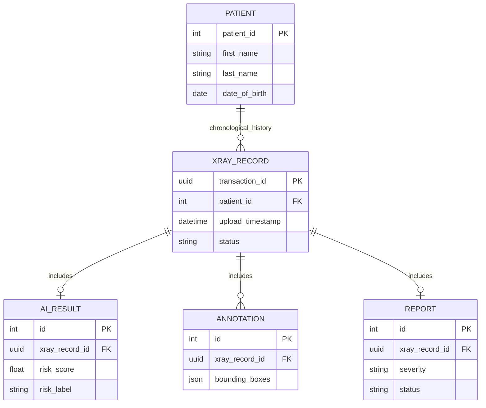

```mermaid
erDiagram
    PATIENT {
        int patient_id PK
        string first_name
        string last_name
        date date_of_birth
    }

    XRAY_RECORD {
        uuid transaction_id PK
        int patient_id FK
        datetime upload_timestamp
        string status
    }

    AI_RESULT {
        int id PK
        uuid xray_record_id FK
        float risk_score
        string risk_label
    }

    ANNOTATION {
        int id PK
        uuid xray_record_id FK
        json bounding_boxes
    }

    REPORT {
        int id PK
        uuid xray_record_id FK
        string severity
        string status
    }

    PATIENT ||--o{ XRAY_RECORD : "chronological_history"
    XRAY_RECORD ||--o| AI_RESULT : "includes"
    XRAY_RECORD ||--o{ ANNOTATION : "includes"
    XRAY_RECORD ||--o| REPORT : "includes"
```
