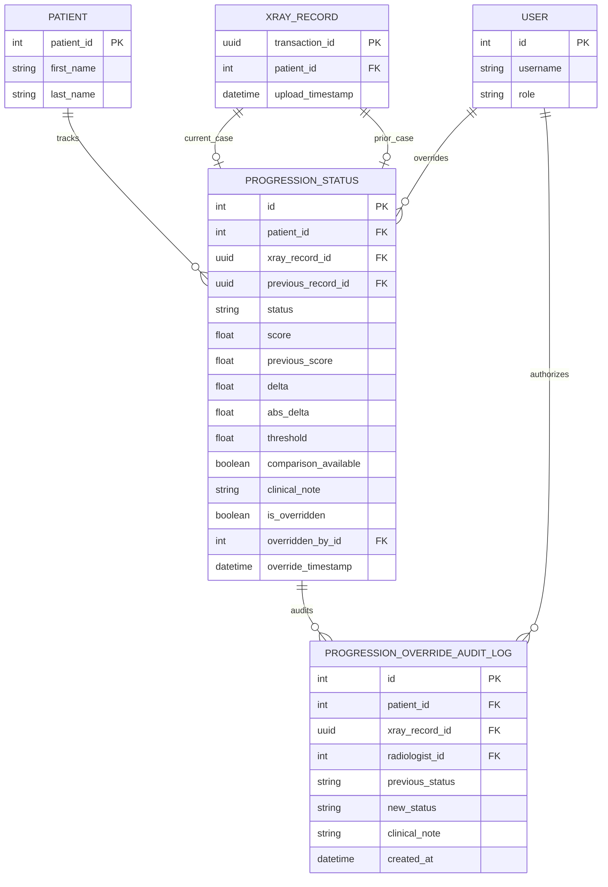

```mermaid
erDiagram
    PATIENT {
        int patient_id PK
        string first_name
        string last_name
    }

    XRAY_RECORD {
        uuid transaction_id PK
        int patient_id FK
        datetime upload_timestamp
    }

    PROGRESSION_STATUS {
        int id PK
        int patient_id FK
        uuid xray_record_id FK
        uuid previous_record_id FK
        string status
        float score
        float previous_score
        float delta
        float abs_delta
        float threshold
        boolean comparison_available
        string clinical_note
        boolean is_overridden
        int overridden_by_id FK
        datetime override_timestamp
    }

    PROGRESSION_OVERRIDE_AUDIT_LOG {
        int id PK
        int patient_id FK
        uuid xray_record_id FK
        int radiologist_id FK
        string previous_status
        string new_status
        string clinical_note
        datetime created_at
    }

    USER {
        int id PK
        string username
        string role
    }

    PATIENT ||--o{ PROGRESSION_STATUS : "tracks"
    XRAY_RECORD ||--o| PROGRESSION_STATUS : "current_case"
    XRAY_RECORD ||--o| PROGRESSION_STATUS : "prior_case"
    USER ||--o{ PROGRESSION_STATUS : "overrides"
    PROGRESSION_STATUS ||--o{ PROGRESSION_OVERRIDE_AUDIT_LOG : "audits"
    USER ||--o{ PROGRESSION_OVERRIDE_AUDIT_LOG : "authorizes"
```
