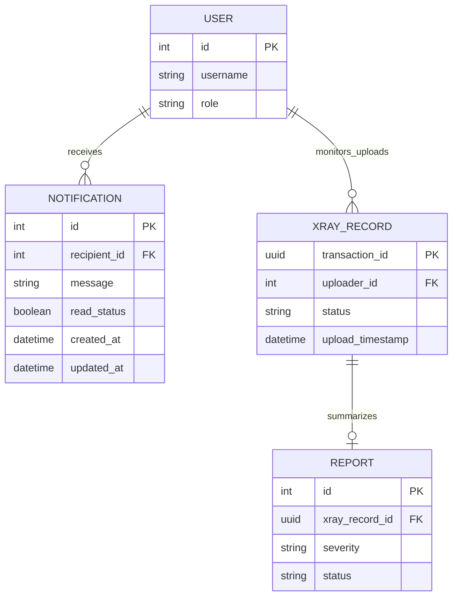

```mermaid
erDiagram
    USER {
        int id PK
        string username
        string role
    }

    NOTIFICATION {
        int id PK
        int recipient_id FK
        string message
        boolean read_status
        datetime created_at
        datetime updated_at
    }

    XRAY_RECORD {
        uuid transaction_id PK
        int uploader_id FK
        string status
        datetime upload_timestamp
    }

    REPORT {
        int id PK
        uuid xray_record_id FK
        string severity
        string status
    }

    USER ||--o{ NOTIFICATION : "receives"
    USER ||--o{ XRAY_RECORD : "monitors_uploads"
    XRAY_RECORD ||--o| REPORT : "summarizes"
```
