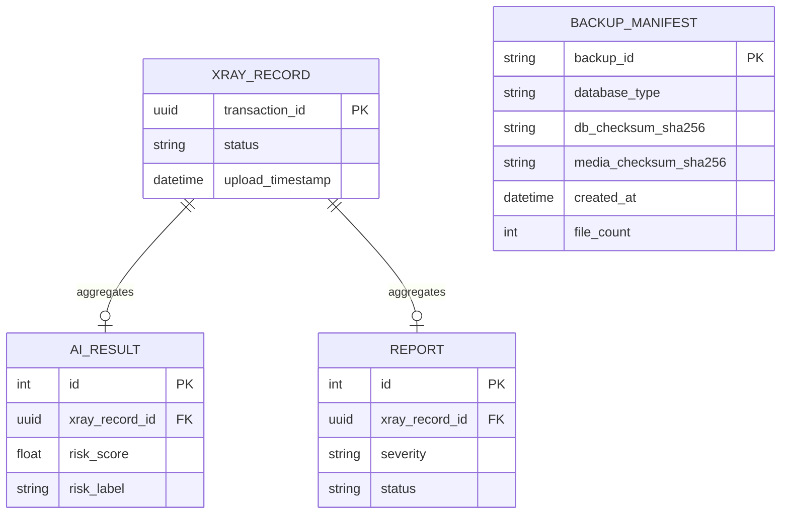

```mermaid
erDiagram
    XRAY_RECORD {
        uuid transaction_id PK
        string status
        datetime upload_timestamp
    }

    AI_RESULT {
        int id PK
        uuid xray_record_id FK
        float risk_score
        string risk_label
    }

    REPORT {
        int id PK
        uuid xray_record_id FK
        string severity
        string status
    }

    BACKUP_MANIFEST {
        string backup_id PK
        string database_type
        string db_checksum_sha256
        string media_checksum_sha256
        datetime created_at
        int file_count
    }

    XRAY_RECORD ||--o| AI_RESULT : "aggregates"
    XRAY_RECORD ||--o| REPORT : "aggregates"
```
