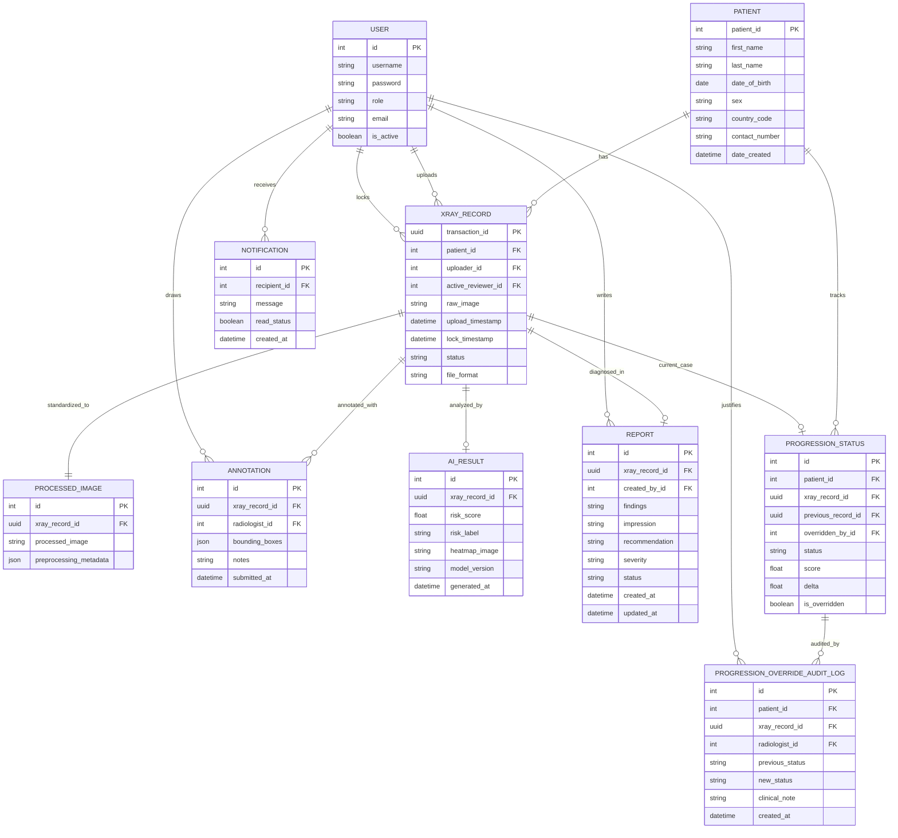

```mermaid
erDiagram
    PATIENT {
        int patient_id PK
        string first_name
        string last_name
        date date_of_birth
        string sex
        string country_code
        string contact_number
        datetime date_created
    }

    USER {
        int id PK
        string username
        string password
        string role
        string email
        boolean is_active
    }

    XRAY_RECORD {
        uuid transaction_id PK
        int patient_id FK
        int uploader_id FK
        int active_reviewer_id FK
        string raw_image
        datetime upload_timestamp
        datetime lock_timestamp
        string status
        string file_format
    }

    PROCESSED_IMAGE {
        int id PK
        uuid xray_record_id FK
        string processed_image
        json preprocessing_metadata
    }

    ANNOTATION {
        int id PK
        uuid xray_record_id FK
        int radiologist_id FK
        json bounding_boxes
        string notes
        datetime submitted_at
    }

    AI_RESULT {
        int id PK
        uuid xray_record_id FK
        float risk_score
        string risk_label
        string heatmap_image
        string model_version
        datetime generated_at
    }

    REPORT {
        int id PK
        uuid xray_record_id FK
        int created_by_id FK
        string findings
        string impression
        string recommendation
        string severity
        string status
        datetime created_at
        datetime updated_at
    }

    NOTIFICATION {
        int id PK
        int recipient_id FK
        string message
        boolean read_status
        datetime created_at
    }

    PROGRESSION_STATUS {
        int id PK
        int patient_id FK
        uuid xray_record_id FK
        uuid previous_record_id FK
        int overridden_by_id FK
        string status
        float score
        float delta
        boolean is_overridden
    }

    PROGRESSION_OVERRIDE_AUDIT_LOG {
        int id PK
        int patient_id FK
        uuid xray_record_id FK
        int radiologist_id FK
        string previous_status
        string new_status
        string clinical_note
        datetime created_at
    }

    PATIENT ||--o{ XRAY_RECORD : "has"
    USER ||--o{ XRAY_RECORD : "uploads"
    USER ||--o{ XRAY_RECORD : "locks"
    XRAY_RECORD ||--|| PROCESSED_IMAGE : "standardized_to"
    XRAY_RECORD ||--o| AI_RESULT : "analyzed_by"
    XRAY_RECORD ||--o{ ANNOTATION : "annotated_with"
    USER ||--o{ ANNOTATION : "draws"
    XRAY_RECORD ||--o| REPORT : "diagnosed_in"
    USER ||--o{ REPORT : "writes"
    USER ||--o{ NOTIFICATION : "receives"
    PATIENT ||--o{ PROGRESSION_STATUS : "tracks"
    XRAY_RECORD ||--o| PROGRESSION_STATUS : "current_case"
    PROGRESSION_STATUS ||--o{ PROGRESSION_OVERRIDE_AUDIT_LOG : "audited_by"
    USER ||--o{ PROGRESSION_OVERRIDE_AUDIT_LOG : "justifies"
```
