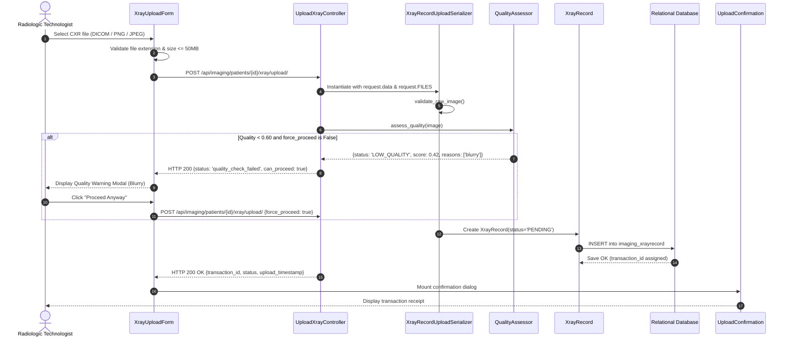

```mermaid
sequenceDiagram
    autonumber
    actor Tech as Radiologic Technologist
    participant Form as XrayUploadForm
    participant View as UploadXrayController
    participant Ser as XrayRecordUploadSerializer
    participant Quality as QualityAssessor
    participant ModelRec as XrayRecord
    participant DB as Relational Database
    participant Confirm as UploadConfirmation

    Tech->>Form: Select CXR file (DICOM / PNG / JPEG)
    Form->>Form: Validate file extension & size <= 50MB
    Form->>View: POST /api/imaging/patients/{id}/xray/upload/
    View->>Ser: Instantiate with request.data & request.FILES
    Ser->>Ser: validate_raw_image()
    View->>Quality: assess_quality(image)
    alt Quality < 0.60 and force_proceed is False
        Quality-->>View: {status: 'LOW_QUALITY', score: 0.42, reasons: ['blurry']}
        View-->>Form: HTTP 200 {status: 'quality_check_failed', can_proceed: true}
        Form-->>Tech: Display Quality Warning Modal (Blurry)
        Tech->>Form: Click "Proceed Anyway"
        Form->>View: POST /api/imaging/patients/{id}/xray/upload/ {force_proceed: true}
    end
    Ser->>ModelRec: Create XrayRecord(status='PENDING')
    ModelRec->>DB: INSERT into imaging_xrayrecord
    DB-->>ModelRec: Save OK (transaction_id assigned)
    View-->>Form: HTTP 200 OK {transaction_id, status, upload_timestamp}
    Form->>Confirm: Mount confirmation dialog
    Confirm-->>Tech: Display transaction receipt
```
