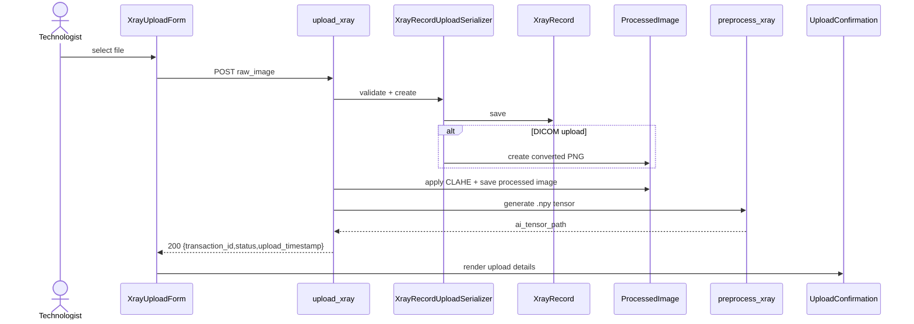

```mermaid
sequenceDiagram
    actor Technologist
    participant Form as XrayUploadForm
    participant API as upload_xray
    participant Ser as XrayRecordUploadSerializer
    participant Rec as XrayRecord
    participant Proc as ProcessedImage
    participant Pre as preprocess_xray
    participant Confirm as UploadConfirmation

    Technologist->>Form: select file
    Form->>API: POST raw_image
    API->>Ser: validate + create
    Ser->>Rec: save
    alt DICOM upload
        Ser->>Proc: create converted PNG
    end
    API->>Proc: apply CLAHE + save processed image
    API->>Pre: generate .npy tensor
    Pre-->>API: ai_tensor_path
    API-->>Form: 200 {transaction_id,status,upload_timestamp}
    Form->>Confirm: render upload details
```
