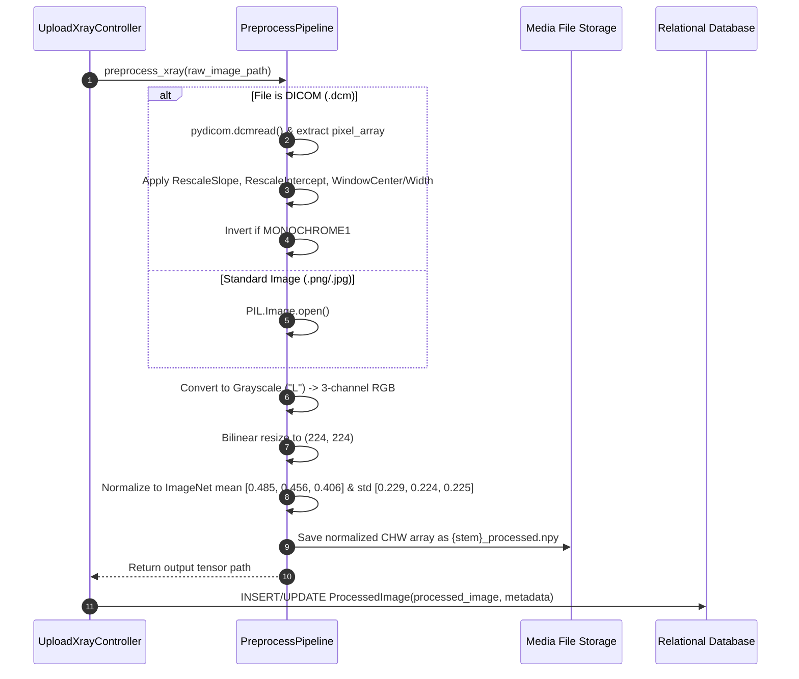

```mermaid
sequenceDiagram
    autonumber
    participant Controller as UploadXrayController
    participant Pipeline as PreprocessPipeline
    participant FS as Media File Storage
    participant DB as Relational Database

    Controller->>Pipeline: preprocess_xray(raw_image_path)
    alt File is DICOM (.dcm)
        Pipeline->>Pipeline: pydicom.dcmread() & extract pixel_array
        Pipeline->>Pipeline: Apply RescaleSlope, RescaleIntercept, WindowCenter/Width
        Pipeline->>Pipeline: Invert if MONOCHROME1
    else Standard Image (.png/.jpg)
        Pipeline->>Pipeline: PIL.Image.open()
    end
    Pipeline->>Pipeline: Convert to Grayscale ("L") -> 3-channel RGB
    Pipeline->>Pipeline: Bilinear resize to (224, 224)
    Pipeline->>Pipeline: Normalize to ImageNet mean [0.485, 0.456, 0.406] & std [0.229, 0.224, 0.225]
    Pipeline->>FS: Save normalized CHW array as {stem}_processed.npy
    Pipeline-->>Controller: Return output tensor path
    Controller->>DB: INSERT/UPDATE ProcessedImage(processed_image, metadata)
```
