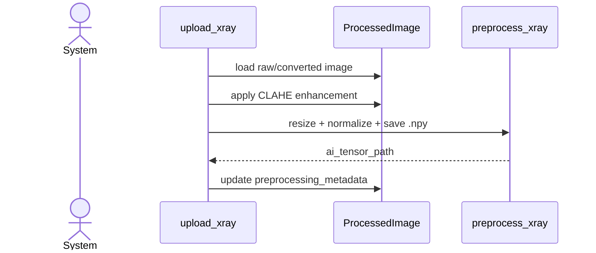

```mermaid
sequenceDiagram
    actor System
    participant API as upload_xray
    participant Proc as ProcessedImage
    participant Pre as preprocess_xray

    API->>Proc: load raw/converted image
    API->>Proc: apply CLAHE enhancement
    API->>Pre: resize + normalize + save .npy
    Pre-->>API: ai_tensor_path
    API->>Proc: update preprocessing_metadata
```
