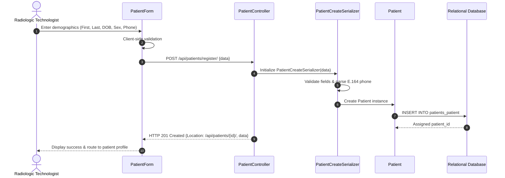

```mermaid
sequenceDiagram
    autonumber
    actor Tech as Radiologic Technologist
    participant Form as PatientForm
    participant View as PatientController
    participant Ser as PatientCreateSerializer
    participant Model as Patient
    participant DB as Relational Database

    Tech->>Form: Enter demographics (First, Last, DOB, Sex, Phone)
    Form->>Form: Client-side validation
    Form->>View: POST /api/patients/register/ {data}
    View->>Ser: Initialize PatientCreateSerializer(data)
    Ser->>Ser: Validate fields & parse E.164 phone
    Ser->>Model: Create Patient instance
    Model->>DB: INSERT INTO patients_patient
    DB-->>Model: Assigned patient_id
    View-->>Form: HTTP 201 Created {Location: /api/patients/{id}/, data}
    Form-->>Tech: Display success & route to patient profile
```
