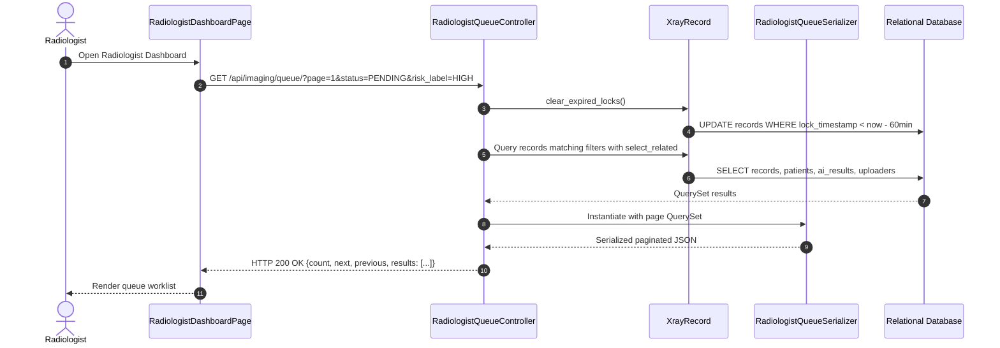

```mermaid
sequenceDiagram
    autonumber
    actor Rad as Radiologist
    participant Page as RadiologistDashboardPage
    participant View as RadiologistQueueController
    participant Model as XrayRecord
    participant Ser as RadiologistQueueSerializer
    participant DB as Relational Database

    Rad->>Page: Open Radiologist Dashboard
    Page->>View: GET /api/imaging/queue/?page=1&status=PENDING&risk_label=HIGH
    View->>Model: clear_expired_locks()
    Model->>DB: UPDATE records WHERE lock_timestamp < now - 60min
    View->>Model: Query records matching filters with select_related
    Model->>DB: SELECT records, patients, ai_results, uploaders
    DB-->>View: QuerySet results
    View->>Ser: Instantiate with page QuerySet
    Ser-->>View: Serialized paginated JSON
    View-->>Page: HTTP 200 OK {count, next, previous, results: [...]}
    Page-->>Rad: Render queue worklist
```
