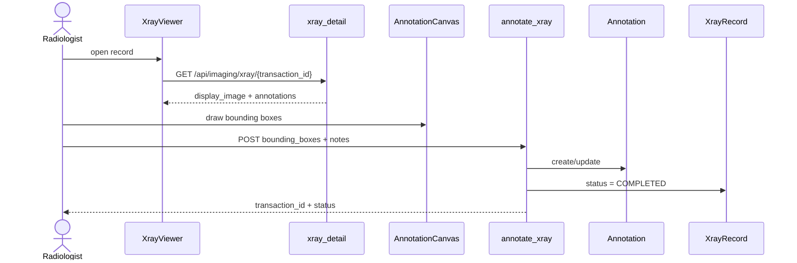

```mermaid
sequenceDiagram
    actor Radiologist
    participant Viewer as XrayViewer
    participant API as xray_detail
    participant Canvas as AnnotationCanvas
    participant Annotate as annotate_xray
    participant Ann as Annotation
    participant Rec as XrayRecord

    Radiologist->>Viewer: open record
    Viewer->>API: GET /api/imaging/xray/{transaction_id}
    API-->>Viewer: display_image + annotations
    Radiologist->>Canvas: draw bounding boxes
    Radiologist->>Annotate: POST bounding_boxes + notes
    Annotate->>Ann: create/update
    Annotate->>Rec: status = COMPLETED
    Annotate-->>Radiologist: transaction_id + status
```
