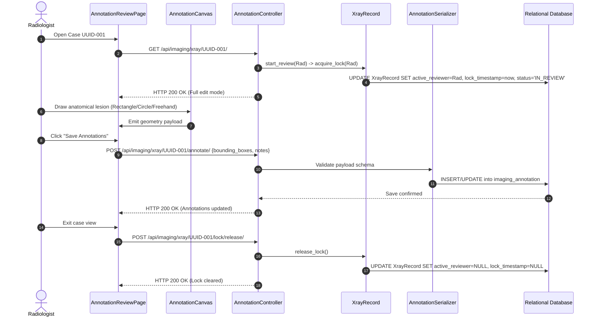

```mermaid
sequenceDiagram
    autonumber
    actor Rad as Radiologist
    participant Page as AnnotationReviewPage
    participant Canvas as AnnotationCanvas
    participant View as AnnotationController
    participant Model as XrayRecord
    participant Ser as AnnotationSerializer
    participant DB as Relational Database

    Rad->>Page: Open Case UUID-001
    Page->>View: GET /api/imaging/xray/UUID-001/
    View->>Model: start_review(Rad) -> acquire_lock(Rad)
    Model->>DB: UPDATE XrayRecord SET active_reviewer=Rad, lock_timestamp=now, status='IN_REVIEW'
    View-->>Page: HTTP 200 OK (Full edit mode)
    Rad->>Canvas: Draw anatomical lesion (Rectangle/Circle/Freehand)
    Canvas->>Page: Emit geometry payload
    Rad->>Page: Click "Save Annotations"
    Page->>View: POST /api/imaging/xray/UUID-001/annotate/ {bounding_boxes, notes}
    View->>Ser: Validate payload schema
    Ser->>DB: INSERT/UPDATE into imaging_annotation
    DB-->>View: Save confirmed
    View-->>Page: HTTP 200 OK (Annotations updated)
    Rad->>Page: Exit case view
    Page->>View: POST /api/imaging/xray/UUID-001/lock/release/
    View->>Model: release_lock()
    Model->>DB: UPDATE XrayRecord SET active_reviewer=NULL, lock_timestamp=NULL
    View-->>Page: HTTP 200 OK (Lock cleared)
```
