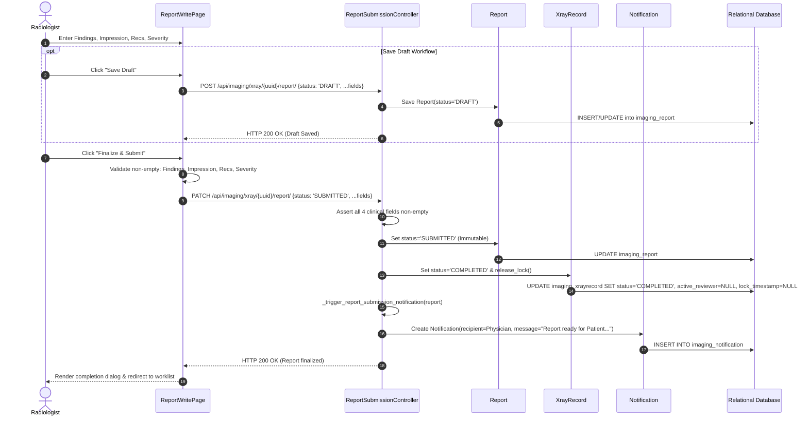

```mermaid
sequenceDiagram
    autonumber
    actor Rad as Radiologist
    participant Form as ReportWritePage
    participant View as ReportSubmissionController
    participant ModelRep as Report
    participant ModelRec as XrayRecord
    participant ModelNotif as Notification
    participant DB as Relational Database

    Rad->>Form: Enter Findings, Impression, Recs, Severity
    opt Save Draft Workflow
        Rad->>Form: Click "Save Draft"
        Form->>View: POST /api/imaging/xray/{uuid}/report/ {status: 'DRAFT', ...fields}
        View->>ModelRep: Save Report(status='DRAFT')
        ModelRep->>DB: INSERT/UPDATE into imaging_report
        View-->>Form: HTTP 200 OK (Draft Saved)
    end
    Rad->>Form: Click "Finalize & Submit"
    Form->>Form: Validate non-empty: Findings, Impression, Recs, Severity
    Form->>View: PATCH /api/imaging/xray/{uuid}/report/ {status: 'SUBMITTED', ...fields}
    View->>View: Assert all 4 clinical fields non-empty
    View->>ModelRep: Set status='SUBMITTED' (Immutable)
    ModelRep->>DB: UPDATE imaging_report
    View->>ModelRec: Set status='COMPLETED' & release_lock()
    ModelRec->>DB: UPDATE imaging_xrayrecord SET status='COMPLETED', active_reviewer=NULL, lock_timestamp=NULL
    View->>View: _trigger_report_submission_notification(report)
    View->>ModelNotif: Create Notification(recipient=Physician, message="Report ready for Patient...")
    ModelNotif->>DB: INSERT INTO imaging_notification
    View-->>Form: HTTP 200 OK (Report finalized)
    Form-->>Rad: Render completion dialog & redirect to worklist
```
