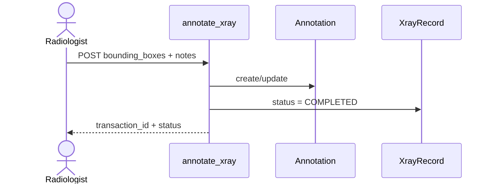

```mermaid
sequenceDiagram
    actor Radiologist
    participant API as annotate_xray
    participant Ann as Annotation
    participant Rec as XrayRecord

    Radiologist->>API: POST bounding_boxes + notes
    API->>Ann: create/update
    API->>Rec: status = COMPLETED
    API-->>Radiologist: transaction_id + status
```
