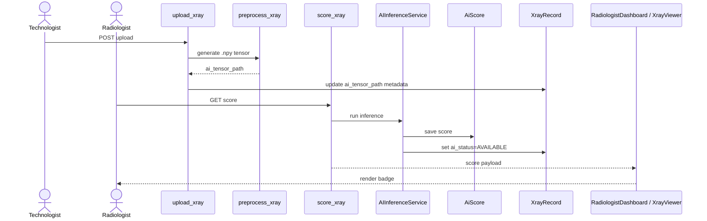

```mermaid
sequenceDiagram
    actor Technologist
    actor Radiologist
    participant API as upload_xray
    participant Pre as preprocess_xray
    participant ScoreAPI as score_xray
    participant AI as AIInferenceService
    participant DB as AiScore
    participant Rec as XrayRecord
    participant UI as RadiologistDashboard / XrayViewer

    Technologist->>API: POST upload
    API->>Pre: generate .npy tensor
    Pre-->>API: ai_tensor_path
    API->>Rec: update ai_tensor_path metadata

    Radiologist->>ScoreAPI: GET score
    ScoreAPI->>AI: run inference
    AI->>DB: save score
    AI->>Rec: set ai_status=AVAILABLE
    ScoreAPI-->>UI: score payload
    UI-->>Radiologist: render badge
```
