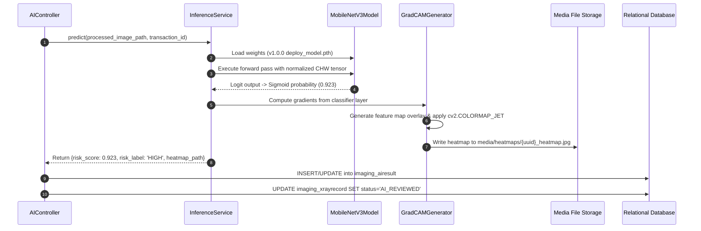

```mermaid
sequenceDiagram
    autonumber
    participant Controller as AIController
    participant InfService as InferenceService
    participant PyTorch as MobileNetV3Model
    participant GradCAM as GradCAMGenerator
    participant FS as Media File Storage
    participant DB as Relational Database

    Controller->>InfService: predict(processed_image_path, transaction_id)
    InfService->>PyTorch: Load weights (v1.0.0 deploy_model.pth)
    InfService->>PyTorch: Execute forward pass with normalized CHW tensor
    PyTorch-->>InfService: Logit output -> Sigmoid probability (0.923)
    InfService->>GradCAM: Compute gradients from classifier layer
    GradCAM->>GradCAM: Generate feature map overlay & apply cv2.COLORMAP_JET
    GradCAM->>FS: Write heatmap to media/heatmaps/{uuid}_heatmap.jpg
    InfService-->>Controller: Return {risk_score: 0.923, risk_label: 'HIGH', heatmap_path}
    Controller->>DB: INSERT/UPDATE into imaging_airesult
    Controller->>DB: UPDATE imaging_xrayrecord SET status='AI_REVIEWED'
```
