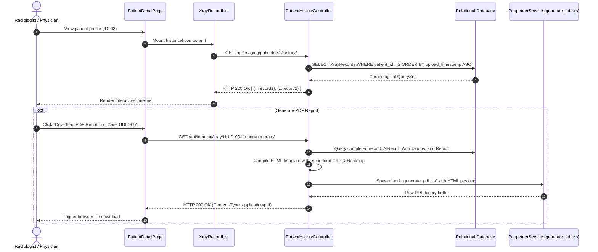

```mermaid
sequenceDiagram
    autonumber
    actor Clinician as Radiologist / Physician
    participant Page as PatientDetailPage
    participant List as XrayRecordList
    participant View as PatientHistoryController
    participant DB as Relational Database
    participant Node as PuppeteerService (generate_pdf.cjs)

    Clinician->>Page: View patient profile (ID: 42)
    Page->>List: Mount historical component
    List->>View: GET /api/imaging/patients/42/history/
    View->>DB: SELECT XrayRecords WHERE patient_id=42 ORDER BY upload_timestamp ASC
    DB-->>View: Chronological QuerySet
    View-->>List: HTTP 200 OK [ {...record1}, {...record2} ]
    List-->>Clinician: Render interactive timeline

    opt Generate PDF Report
        Clinician->>Page: Click "Download PDF Report" on Case UUID-001
        Page->>View: GET /api/imaging/xray/UUID-001/report/generate/
        View->>DB: Query completed record, AIResult, Annotations, and Report
        View->>View: Compile HTML template with embedded CXR & Heatmap
        View->>Node: Spawn `node generate_pdf.cjs` with HTML payload
        Node-->>View: Raw PDF binary buffer
        View-->>Page: HTTP 200 OK (Content-Type: application/pdf)
        Page-->>Clinician: Trigger browser file download
    end
```
